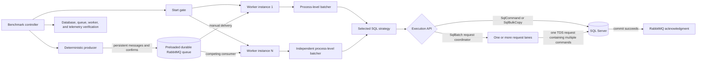
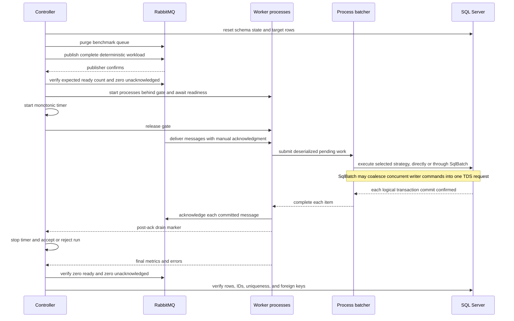
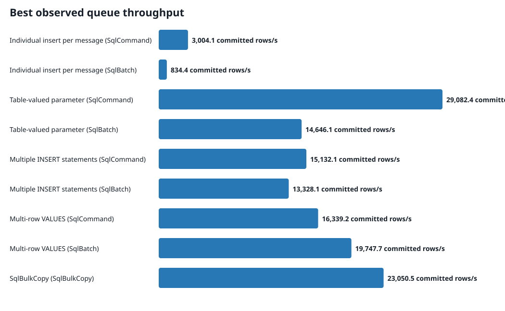
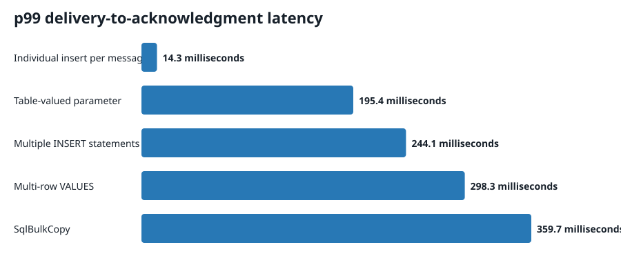

# SQL Server insert batching benchmarks

This repository asks a narrow question: for a preloaded RabbitMQ workload, which tested combination of SQL insert strategy, SQL execution API, process-level batcher, writer concurrency, batch size, batching delay, channel capacity, prefetch, parent-key distribution, and worker count commits rows fastest without weakening transaction or acknowledgment semantics?

The answer is an observed result, not a universal recommendation. It applies only to the recorded machine, container limits, schema, workload, durability settings, and configuration matrix.

## Architecture



Each worker process owns its batching state. Worker processes consume from the same queue as competing consumers. The generic batching library has no SQL Server, RabbitMQ, ASP.NET Core, benchmark entity, or benchmark message dependency.



## Persistence strategies

- **Individual insert per message.** One parameterized `INSERT`, one transaction commit, then one acknowledgment. Its legal batch size is one.
- **Table-valued parameter.** The client streams `SqlDataRecord` values into `dbo.BenchmarkRowType`; `dbo.InsertBenchmarkRows` performs one set-based insert and one commit.
- **Multiple INSERT statements.** One parameterized command contains one complete `INSERT` statement per item and commits once. Data values never enter command text.
- **Multi-row VALUES.** One parameterized `INSERT ... VALUES (...), (...)` command commits once. Thirteen parameters per row and SQL Server's 2,100-parameter ceiling limit a command to 161 rows.
- **SqlBulkCopy.** Client-side `Microsoft.Data.SqlClient.SqlBulkCopy` writes through the same explicit transaction with check constraints, null preservation, configurable table locking, timeout, batch size, and streaming mode. This is not T-SQL `BULK INSERT`.

Every strategy uses `READ COMMITTED`, full transaction-log commit semantics, the same target table, constraints, indexes, connection pool, command timeout, and database durability settings. SQL Server uses `SIMPLE` recovery with `DELAYED_DURABILITY = DISABLED`. Simple recovery controls log reuse; it does not turn a transaction commit into a delayed commit.

## SQL execution APIs

`sqlExecution` is independent of the five persistence strategies. `Native` uses `SqlCommand` for individual, TVP, multiple-statement, and multi-row writes, and `SqlBulkCopy` for bulk copy. `SqlBatch` is available for the four command-based strategies; it is not a sixth persistence strategy and it does not replace their SQL shape.

For `SqlBatch`, each process-batcher handler call becomes one `SqlBatchCommand`. A process-local coordinator can collect commands from concurrent writers up to `sqlBatchMaximumCommands`, stopping when that cap or `sqlBatchMaximumDelayMilliseconds` is reached. `sqlBatchRequestConcurrency` controls how many coordinator lanes may execute calls concurrently. One lane maximizes coalescing but serializes SQL work on one connection; several lanes retain more connection concurrency while still permitting multiple commands per execute.

Microsoft.Data.SqlClient 7.0.2 serializes the commands as separate RPC records in [one TDS request message](https://github.com/dotnet/SqlClient/blob/v7.0.2/src/Microsoft.Data.SqlClient/src/Microsoft/Data/SqlClient/SqlBatch.cs#L220-L239), using the driver's [batch RPC writer](https://github.com/dotnet/SqlClient/blob/v7.0.2/src/Microsoft.Data.SqlClient/src/Microsoft/Data/SqlClient/SqlCommand.Batch.cs#L16-L44). That is one logical client round trip, not necessarily one TCP packet, and SQL Server still executes the commands serially within each request lane. `SqlBatch.Prepare` is a no-op in the pinned driver, so the benchmark does not call it.

Every coalesced command contains its own `BEGIN TRANSACTION`, selected insert operation, and `COMMIT`. An output parameter confirms that specific commit before its work item can complete. The connection string sets `Enlist=false`, preventing an ambient transaction from invalidating those independent commit boundaries. A normal error rolls back its command; commands committed earlier in the same request remain committed, while the failing command and later unexecuted commands fail and remain unacknowledged. Primary throughput runs disable retries and fail immediately, so partial-error behavior never contributes a valid performance result.

## Process batching

The `ChannelBatcher<T>` implementation uses a bounded `Channel<T>`, configurable handler concurrency, a maximum batch size, and a monotonic maximum-delay deadline. Bounded writes apply backpressure. Shutdown closes the writer and drains every accepted item before stopping. Pooled work items and batches keep the steady-state path allocation-light; each submission receives a single-consumer `ValueTask` that reports its own completion or failure. Metrics cover queue depth, channel wait, batch size, fill time, handler time, completions, failures, and backpressure without retaining an unbounded sample list.

The `LockSwapBatcher<T>` implementation has no intermediate channel. Producers append under a short lock; a full buffer or periodic timer swaps ownership of the pooled buffer. A capacity semaphore applies equivalent backpressure and a handler semaphore limits concurrency. It drains the final partial buffer on shutdown.

The no-batching baseline invokes the handler immediately. It is used for individual insert per message and does not count as the second batching design.

## Queue and completion semantics

The producer creates deterministic message IDs and payloads, publishes persistent messages to a durable queue, and waits for publisher confirms. Workers stay behind a start gate until the controller verifies the full ready-message count. Publication and process startup are outside the measured interval.

Workers deserialize on delivery. A SQL-backed item becomes committed only after its transaction commits. Each RabbitMQ channel owns one acknowledgment pump that consumes successful item completions and issues one `BasicAck` per delivery in sequence. A message counts as completed only after its commit and acknowledgment both succeed. The primary runs disable automatic connection recovery and application retry. A failed batch stops the worker, leaves its deliveries unacknowledged, and invalidates the run.

Delivery-to-commit and delivery-to-acknowledgment use `Stopwatch` timestamps inside the worker. Deliberate queue residence before the gate is not reported as latency. Delivered, committed, and acknowledged counts remain separate in every raw result.

The no-op queue control uses the same client, payload, JSON deserialization, competing-consumer topology, prefetch, process batcher, and manual acknowledgment path. Its handler performs no database write. The direct database control sends the pre-generated in-memory rows through the same SQL strategy classes without RabbitMQ, deserialization, process batching, or acknowledgments.

## Schema and data

`dbo.ParentEntity` contains 10,000 seeded rows. `dbo.BenchmarkTarget` has a `bigint IDENTITY` clustered primary key; a unique constraint on deterministic `MessageId`; a foreign key and supporting index on `ParentId`; and columns using `uniqueidentifier`, `datetime2(3)`, `int`, `bigint`, `smallint`, `decimal(18,4)`, `bit`, `varchar`, `nvarchar`, `binary(16)`, and nullable `nvarchar`. The schema stays unchanged across strategies.

The checked-in schema estimates a 390-byte logical row before page and index overhead. The runner records the average serialized JSON message size from each workload in raw output.

The default seed is `1592606758` (`0x5EED2026`). `System.Random` selects parent IDs; SHA-256 of the seed and sequence creates message and correlation IDs plus fixed binary data. Other values derive from the sequence or seeded generator. The three profiles are:

- **Uniform:** every parent ID has equal selection probability.
- **Moderate skew:** 80% of rows select uniformly from parent IDs 1 through 2,000; 20% select from 2,001 through 10,000.
- **Hot parent:** 95% reference parent ID 1; 5% select uniformly from the other parents.

Every strategy in a distribution receives rows generated by the same algorithm and seed.

## Search method

`config/Full.json` is generated by `scripts/generate-full-profile.ps1` and checked in. Its 129 scenarios bound the five-strategy search rather than forming a wasteful Cartesian product. The broad stage covers every strategy and distribution. Refinement stages vary legal batch sizes, 1/5/20/50 ms delays, capacities, prefetch values, channel versus lock-swap batching, 1/2/4/8 writers, and 1/2/4 worker processes. It also includes single-request SqlBatch controls, writer and command-cap sweeps, and direct controls. Dynamic SQL tests stop at the calculated 161-row legal maximum. TVP and bulk copy test 10, 50, 100, 500, 1,000, and 5,000 rows. `config/Confirmation.json` repeats the selected native finalist for each persistence strategy three times with 750,000 identical rows per run.

`config/SqlBatch.json`, generated by `scripts/generate-sqlbatch-profile.ps1`, contains 106 targeted scenarios. The `cap=1, lanes=writers` Native and SqlBatch pairs isolate the execution API closely at 1/2/4/8 writers. Separate coalescing scenarios vary commands per execute and request-lane concurrency together, so their concurrency difference is explicit rather than attributed solely to the API. Refinement also varies coalescing delay, 1/2/4 worker processes, and all three parent-key distributions. Direct controls remain separate, and six no-op controls match the finalist process-batcher, writer, and prefetch configurations. `config/SqlBatchConfirmation.json` repeats the selected Native and SqlBatch finalists three times with strategy-specific row counts chosen to produce stable runs.

Stages run in search order; scenario order is rotated deterministically inside each stage. Each implementation receives an unreported warmup, followed by a database and queue reset. Raw configuration remains attached to every result.

<!-- RESULTS:START -->

## Measured results

Generated from 239 raw scenario files. 239 passed every correctness check.
Measured binaries: `2f0f925` (4 runs), `31f7dec` (130 runs), `c6d3469` (15 runs), `e0d9785` (90 runs).

### SqlBatch conclusion

These are observed medians from the repeated finalist matrix, not global optima. Throughput remains the selection metric even when the faster path allocates more.

| Binary | Strategy | Native median rows/s | SqlBatch median rows/s | Change | Faster tested API |
|---|---|---:|---:|---:|---|
| `31f7dec` | Individual insert per message | 1,333 | 339 | -74.6% | Native |
| `31f7dec` | Table-valued parameter | 12,685 | 13,090 | 3.2% | SqlBatch |
| `31f7dec` | Multiple INSERT statements | 12,198 | 12,919 | 5.9% | SqlBatch |
| `31f7dec` | Multi-row VALUES | 14,517 | 19,568 | 34.8% | SqlBatch |

### Same-binary no-op queue ceilings

A ceiling is compared only when its binary, worker topology, process batcher, batch settings, prefetch, seed, and distribution match that binary's fastest SQL-backed run.

| Binary | Fastest SQL-backed scenario | SQL rows/s | Matching no-op ack/s | No-op p99 ack | Headroom | Attribution |
|---|---|---:|---:|---:|---:|---|
| `2f0f925` | confirmed-table-valued-parameter | 27,790 | n/a | n/a | n/a | unavailable: no matching control |
| `31f7dec` | confirmed-sqlbatch-multi-row-values-sqlbatch | 19,748 | 31,798 | 6.56 ms | 1.61x | RabbitMQ ceiling not reached |
| `c6d3469` | confirmed-table-valued-parameter | 29,082 | n/a | n/a | n/a | unavailable: no matching control |
| `e0d9785` | finalist-bulkcopy | 23,051 | n/a | n/a | n/a | unavailable: no matching control |





### Best observed queue configuration by strategy and SQL execution API

| Strategy | SQL API | SqlBatch cap/lanes/delay | Batcher | Workers x writers | Batch | Delay | Capacity | Prefetch | Distribution | Rows | Rows/s | DML execute calls | Rows/execute | Commands/execute mean/p95/max | p50 commit | p99 ack | Speedup | Correct |
|---|---|---:|---|---:|---:|---:|---:|---:|---|---:|---:|---:|---:|---:|---:|---:|---:|---|
| Individual insert per message | SqlCommand | n/a | None | 2 x 4 | 1 | 5 ms | 1,000 | 250 | Uniform | 10,000 | 3,004 | n/a | n/a | n/a | 7.74 ms | 20.90 ms | 1.00x | yes |
| Individual insert per message | SqlBatch | 1/8/1 ms | None | 1 x 8 | 1 | 5 ms | 1,000 | 250 | Uniform | 2,000 | 834 | 2,000 | 1.0 | 1.00/1/1 | 64.49 ms | 306.95 ms | 0.28x | yes |
| Table-valued parameter | SqlCommand | n/a | Channel | 1 x 2 | 5,000 | 5 ms | 10,000 | 20,000 | Uniform | 750,000 | 29,082 | n/a | n/a | n/a | 167.23 ms | 417.83 ms | 9.68x | yes |
| Table-valued parameter | SqlBatch | 4/1/1 ms | Channel | 1 x 4 | 500 | 5 ms | 4,000 | 2,000 | Uniform | 750,000 | 14,646 | 797 | 941.0 | 2.00/3/4 | 369.73 ms | 502.43 ms | 4.88x | yes |
| Multiple INSERT statements | SqlCommand | n/a | Channel | 4 x 2 | 50 | 5 ms | 2,000 | 200 | Uniform | 750,000 | 15,132 | n/a | n/a | n/a | 94.89 ms | 158.06 ms | 5.04x | yes |
| Multiple INSERT statements | SqlBatch | 1/4/1 ms | Channel | 1 x 4 | 50 | 5 ms | 2,000 | 400 | Uniform | 500,000 | 13,328 | 10,001 | 50.0 | 1.00/1/1 | 110.27 ms | 240.34 ms | 4.44x | yes |
| Multi-row VALUES | SqlCommand | n/a | Channel | 1 x 8 | 100 | 5 ms | 2,000 | 800 | Uniform | 20,000 | 16,339 | 202 | 99.0 | 1.00/1/1 | 120.43 ms | 509.40 ms | 5.44x | yes |
| Multi-row VALUES | SqlBatch | 1/4/1 ms | Channel | 1 x 4 | 100 | 5 ms | 2,000 | 800 | Uniform | 500,000 | 19,748 | 5,004 | 99.9 | 1.00/1/1 | 117.92 ms | 177.81 ms | 6.57x | yes |
| SqlBulkCopy | SqlBulkCopy | n/a | Channel | 1 x 2 | 1,000 | 5 ms | 8,000 | 2,000 | Uniform | 250,000 | 23,051 | n/a | n/a | n/a | 118.56 ms | 412.96 ms | 7.67x | yes |

### Paired SqlCommand and SqlBatch executions

Each pair uses the same measured binary, rows, seed, distribution, worker topology, process batcher, logical batch size, capacity, and prefetch. Each SqlBatch request lane has one outstanding execution and its commands execute serially on that connection. Counts are DML execute API invocations. Native transaction begin and commit operations are outside this counter, so it is not a total network or TDS round-trip count. A SqlBatch execute is sent as one TDS request containing one RPC record per command.

| Stage | Repetition | Strategy | Distribution | Workers x writers | Logical batch | SqlBatch cap/lanes/delay | Actual commands/execute mean/p95/max | Native rows/s | SqlBatch rows/s | Rate change | Native DML executes | SqlBatch DML executes | Execute reduction | SqlBatch p99 ack |
|---|---:|---|---|---:|---:|---:|---:|---:|---:|---:|---:|---:|---:|---:|
| single-command-control | 1 | Individual insert per message | Uniform | 1 x 1 | 1 | 1/1/1 ms | 1.00/1/1 | 133 | 110 | -17.3 % | 2,000 | 2,000 | 0.0 % | 163.62 ms |
| single-command-control | 1 | Table-valued parameter | Uniform | 1 x 1 | 500 | 1/1/1 ms | 1.00/1/1 | 9,503 | 10,229 | 7.6 % | 41 | 41 | 0.0 % | 331.22 ms |
| single-command-control | 1 | Multiple INSERT statements | Uniform | 1 x 1 | 50 | 1/1/1 ms | 1.00/1/1 | 3,429 | 3,521 | 2.7 % | 400 | 400 | 0.0 % | 211.92 ms |
| single-command-control | 1 | Multi-row VALUES | Uniform | 1 x 1 | 100 | 1/1/1 ms | 1.00/1/1 | 3,981 | 4,610 | 15.8 % | 200 | 200 | 0.0 % | 293.73 ms |
| writer-scaling | 1 | Individual insert per message | Uniform | 1 x 2 | 1 | 2/1/1 ms | 2.00/2/2 | 493 | 166 | -66.2 % | 2,000 | 1,000 | 50.0 % | 40.15 ms |
| writer-scaling | 1 | Individual insert per message | Uniform | 1 x 4 | 1 | 4/1/1 ms | 4.00/4/4 | 1,269 | 108 | -91.5 % | 2,000 | 500 | 75.0 % | 2,613.36 ms |
| writer-scaling | 1 | Individual insert per message | Uniform | 1 x 8 | 1 | 8/1/1 ms | 8.00/8/8 | 1,143 | 185 | -83.8 % | 2,000 | 250 | 87.5 % | 510.31 ms |
| writer-scaling | 1 | Table-valued parameter | Uniform | 1 x 2 | 500 | 2/1/1 ms | 1.08/2/2 | 12,810 | 11,107 | -13.3 % | 41 | 38 | 7.3 % | 481.68 ms |
| writer-scaling | 1 | Table-valued parameter | Uniform | 1 x 4 | 500 | 4/1/1 ms | 2.16/4/4 | 12,801 | 12,605 | -1.5 % | 44 | 19 | 56.8 % | 529.19 ms |
| writer-scaling | 1 | Table-valued parameter | Uniform | 1 x 8 | 500 | 8/1/1 ms | 5.62/8/8 | 11,315 | 12,136 | 7.3 % | 52 | 8 | 84.6 % | 658.94 ms |
| writer-scaling | 1 | Multiple INSERT statements | Uniform | 1 x 2 | 50 | 2/1/1 ms | 1.03/1/2 | 7,141 | 3,683 | -48.4 % | 400 | 389 | 2.7 % | 367.24 ms |
| writer-scaling | 1 | Multiple INSERT statements | Uniform | 1 x 4 | 50 | 4/1/1 ms | 2.05/2/4 | 11,524 | 3,721 | -67.7 % | 400 | 195 | 51.2 % | 605.64 ms |
| writer-scaling | 1 | Multiple INSERT statements | Uniform | 1 x 8 | 50 | 8/1/1 ms | 4.08/7/8 | 12,851 | 3,890 | -69.7 % | 400 | 98 | 75.5 % | 977.33 ms |
| writer-scaling | 1 | Multi-row VALUES | Uniform | 1 x 2 | 100 | 2/1/1 ms | 1.03/1/2 | 9,111 | 4,671 | -48.7 % | 200 | 195 | 2.5 % | 436.03 ms |
| writer-scaling | 1 | Multi-row VALUES | Uniform | 1 x 4 | 100 | 4/1/1 ms | 2.08/3/4 | 15,503 | 4,452 | -71.3 % | 200 | 96 | 52.0 % | 632.73 ms |
| writer-scaling | 1 | Multi-row VALUES | Uniform | 1 x 8 | 100 | 8/1/1 ms | 4.55/8/8 | 16,339 | 4,455 | -72.7 % | 202 | 44 | 78.2 % | 798.92 ms |
| command-cap | 1 | Individual insert per message | Uniform | 1 x 8 | 1 | 1/1/1 ms | 1.00/1/1 | 1,143 | 159 | -86.1 % | 2,000 | 2,000 | 0.0 % | 571.09 ms |
| command-cap | 1 | Individual insert per message | Uniform | 1 x 8 | 1 | 2/1/1 ms | 2.00/2/2 | 1,143 | 160 | -86.0 % | 2,000 | 1,000 | 50.0 % | 556.16 ms |
| command-cap | 1 | Individual insert per message | Uniform | 1 x 8 | 1 | 4/1/1 ms | 4.00/4/4 | 1,143 | 100 | -91.2 % | 2,000 | 500 | 75.0 % | 3,573.39 ms |
| command-cap | 1 | Table-valued parameter | Uniform | 1 x 8 | 500 | 1/1/1 ms | 1.00/1/1 | 11,315 | 10,406 | -8.0 % | 52 | 43 | 17.3 % | 744.56 ms |
| command-cap | 1 | Table-valued parameter | Uniform | 1 x 8 | 500 | 2/1/1 ms | 2.00/2/2 | 11,315 | 2,204 | -80.5 % | 52 | 22 | 57.7 % | 7,938.63 ms |
| command-cap | 1 | Table-valued parameter | Uniform | 1 x 8 | 500 | 4/1/1 ms | 4.00/4/4 | 11,315 | 11,797 | 4.3 % | 52 | 11 | 78.8 % | 737.33 ms |
| command-cap | 1 | Multiple INSERT statements | Uniform | 1 x 8 | 50 | 1/1/1 ms | 1.00/1/1 | 12,851 | 3,542 | -72.4 % | 400 | 400 | 0.0 % | 1,104.35 ms |
| command-cap | 1 | Multiple INSERT statements | Uniform | 1 x 8 | 50 | 2/1/1 ms | 2.00/2/2 | 12,851 | 3,694 | -71.3 % | 400 | 200 | 50.0 % | 1,001.42 ms |
| command-cap | 1 | Multiple INSERT statements | Uniform | 1 x 8 | 50 | 4/1/1 ms | 4.00/4/4 | 12,851 | 3,990 | -69.0 % | 400 | 100 | 75.0 % | 950.75 ms |
| command-cap | 1 | Multi-row VALUES | Uniform | 1 x 8 | 100 | 1/1/1 ms | 1.00/1/1 | 16,339 | 4,869 | -70.2 % | 202 | 200 | 1.0 % | 723.06 ms |
| command-cap | 1 | Multi-row VALUES | Uniform | 1 x 8 | 100 | 2/1/1 ms | 2.00/2/2 | 16,339 | 5,239 | -67.9 % | 202 | 100 | 50.5 % | 654.56 ms |
| command-cap | 1 | Multi-row VALUES | Uniform | 1 x 8 | 100 | 4/1/1 ms | 4.00/4/4 | 16,339 | 4,618 | -71.7 % | 202 | 50 | 75.2 % | 728.05 ms |
| request-concurrency | 1 | Individual insert per message | Uniform | 1 x 4 | 1 | 1/4/1 ms | 1.00/1/1 | 1,269 | 487 | -61.7 % | 2,000 | 2,000 | 0.0 % | 55.97 ms |
| request-concurrency | 1 | Individual insert per message | Uniform | 1 x 4 | 1 | 2/2/1 ms | 2.00/2/2 | 1,269 | 317 | -75.0 % | 2,000 | 1,000 | 50.0 % | 112.00 ms |
| request-concurrency | 1 | Individual insert per message | Uniform | 1 x 8 | 1 | 1/8/1 ms | 1.00/1/1 | 1,143 | 834 | -27.0 % | 2,000 | 2,000 | 0.0 % | 306.95 ms |
| request-concurrency | 1 | Individual insert per message | Uniform | 1 x 8 | 1 | 2/4/1 ms | 2.00/2/2 | 1,143 | 473 | -58.6 % | 2,000 | 1,001 | 50.0 % | 317.04 ms |
| request-concurrency | 1 | Individual insert per message | Uniform | 1 x 8 | 1 | 4/2/1 ms | 4.00/4/4 | 1,143 | 269 | -76.4 % | 2,000 | 500 | 75.0 % | 416.88 ms |
| request-concurrency | 1 | Table-valued parameter | Uniform | 1 x 4 | 500 | 1/4/1 ms | 1.00/1/1 | 12,801 | 13,304 | 3.9 % | 44 | 44 | 0.0 % | 529.74 ms |
| request-concurrency | 1 | Table-valued parameter | Uniform | 1 x 4 | 500 | 2/2/1 ms | 1.32/2/2 | 12,801 | 10,474 | -18.2 % | 44 | 31 | 29.5 % | 672.39 ms |
| request-concurrency | 1 | Table-valued parameter | Uniform | 1 x 8 | 500 | 1/8/1 ms | 1.00/1/1 | 11,315 | 1,751 | -84.5 % | 52 | 45 | 13.5 % | 9,402.62 ms |
| request-concurrency | 1 | Table-valued parameter | Uniform | 1 x 8 | 500 | 2/4/1 ms | 1.59/2/2 | 11,315 | 2,185 | -80.7 % | 52 | 27 | 48.1 % | 8,331.60 ms |
| request-concurrency | 1 | Table-valued parameter | Uniform | 1 x 8 | 500 | 4/2/1 ms | 3.13/4/4 | 11,315 | 2,180 | -80.7 % | 52 | 15 | 71.2 % | 4,520.16 ms |
| request-concurrency | 1 | Multiple INSERT statements | Uniform | 1 x 4 | 50 | 1/4/1 ms | 1.00/1/1 | 11,524 | 11,513 | -0.1 % | 400 | 400 | 0.0 % | 354.67 ms |
| request-concurrency | 1 | Multiple INSERT statements | Uniform | 1 x 4 | 50 | 2/2/1 ms | 1.28/2/2 | 11,524 | 6,650 | -42.3 % | 400 | 313 | 21.8 % | 471.65 ms |
| request-concurrency | 1 | Multiple INSERT statements | Uniform | 1 x 8 | 50 | 1/8/1 ms | 1.00/1/1 | 12,851 | 12,955 | 0.8 % | 400 | 401 | -0.2 % | 366.24 ms |
| request-concurrency | 1 | Multiple INSERT statements | Uniform | 1 x 8 | 50 | 2/4/1 ms | 1.81/2/2 | 12,851 | 11,329 | -11.8 % | 400 | 222 | 44.5 % | 401.32 ms |
| request-concurrency | 1 | Multiple INSERT statements | Uniform | 1 x 8 | 50 | 4/2/1 ms | 3.06/4/4 | 12,851 | 6,727 | -47.7 % | 400 | 131 | 67.2 % | 524.31 ms |
| request-concurrency | 1 | Multi-row VALUES | Uniform | 1 x 4 | 100 | 1/4/1 ms | 1.00/1/1 | 15,503 | 15,114 | -2.5 % | 200 | 200 | 0.0 % | 346.73 ms |
| request-concurrency | 1 | Multi-row VALUES | Uniform | 1 x 4 | 100 | 2/2/1 ms | 2.00/2/2 | 15,503 | 7,840 | -49.4 % | 200 | 100 | 50.0 % | 465.35 ms |
| request-concurrency | 1 | Multi-row VALUES | Uniform | 1 x 8 | 100 | 1/8/1 ms | 1.00/1/1 | 16,339 | 16,030 | -1.9 % | 202 | 200 | 1.0 % | 631.93 ms |
| request-concurrency | 1 | Multi-row VALUES | Uniform | 1 x 8 | 100 | 2/4/1 ms | 1.83/2/2 | 16,339 | 13,554 | -17.0 % | 202 | 110 | 45.5 % | 406.43 ms |
| request-concurrency | 1 | Multi-row VALUES | Uniform | 1 x 8 | 100 | 4/2/1 ms | 3.72/4/4 | 16,339 | 9,364 | -42.7 % | 202 | 54 | 73.3 % | 532.63 ms |
| delay | 1 | Individual insert per message | Uniform | 1 x 4 | 1 | 4/1/5 ms | 4.00/4/4 | 1,269 | 181 | -85.8 % | 2,000 | 500 | 75.0 % | 132.22 ms |
| delay | 1 | Individual insert per message | Uniform | 1 x 4 | 1 | 4/1/20 ms | 4.00/4/4 | 1,269 | 177 | -86.1 % | 2,000 | 500 | 75.0 % | 148.15 ms |
| delay | 1 | Multiple INSERT statements | Uniform | 1 x 4 | 50 | 4/1/5 ms | 4.00/4/4 | 11,524 | 1,192 | -89.7 % | 400 | 100 | 75.0 % | 5,474.05 ms |
| delay | 1 | Multiple INSERT statements | Uniform | 1 x 4 | 50 | 4/1/20 ms | 4.00/4/4 | 11,524 | 3,624 | -68.5 % | 400 | 100 | 75.0 % | 623.12 ms |
| distribution | 1 | Individual insert per message | ModerateSkew | 1 x 4 | 1 | 4/1/1 ms | 4.00/4/4 | 1,223 | 169 | -86.1 % | 2,000 | 500 | 75.0 % | 145.45 ms |
| distribution | 1 | Individual insert per message | HotParent | 1 x 4 | 1 | 4/1/1 ms | 4.00/4/4 | 1,255 | 178 | -85.8 % | 2,000 | 500 | 75.0 % | 134.00 ms |
| distribution | 1 | Table-valued parameter | ModerateSkew | 1 x 4 | 500 | 4/1/1 ms | 2.22/4/4 | 9,968 | 12,868 | 29.1 % | 47 | 18 | 61.7 % | 579.22 ms |
| distribution | 1 | Table-valued parameter | HotParent | 1 x 4 | 500 | 4/1/1 ms | 2.26/4/4 | 12,602 | 12,299 | -2.4 % | 41 | 19 | 53.7 % | 572.32 ms |
| distribution | 1 | Multiple INSERT statements | ModerateSkew | 1 x 4 | 50 | 4/1/1 ms | 2.04/3/4 | 2,306 | 4,063 | 76.2 % | 400 | 196 | 51.0 % | 602.10 ms |
| distribution | 1 | Multiple INSERT statements | HotParent | 1 x 4 | 50 | 4/1/1 ms | 2.04/3/4 | 11,301 | 3,717 | -67.1 % | 401 | 196 | 51.1 % | 522.05 ms |
| distribution | 1 | Multi-row VALUES | ModerateSkew | 1 x 4 | 100 | 4/1/1 ms | 2.22/4/4 | 2,851 | 2,350 | -17.6 % | 200 | 90 | 55.0 % | 4,266.06 ms |
| distribution | 1 | Multi-row VALUES | HotParent | 1 x 4 | 100 | 4/1/1 ms | 2.15/4/4 | 14,134 | 5,017 | -64.5 % | 200 | 93 | 53.5 % | 802.20 ms |
| instance-scaling | 1 | Individual insert per message | Uniform | 2 x 4 | 1 | 4/1/1 ms | 4.00/4/4 | 1,513 | 205 | -86.5 % | 2,000 | 500 | 75.0 % | 277.25 ms |
| instance-scaling | 1 | Individual insert per message | Uniform | 4 x 4 | 1 | 4/1/1 ms | 3.78/4/4 | 1,210 | 425 | -64.9 % | 2,000 | 529 | 73.6 % | 227.51 ms |
| instance-scaling | 1 | Multiple INSERT statements | Uniform | 2 x 4 | 50 | 4/1/1 ms | 2.09/3/4 | 12,845 | 5,958 | -53.6 % | 400 | 191 | 52.2 % | 657.63 ms |
| instance-scaling | 1 | Multiple INSERT statements | Uniform | 4 x 4 | 50 | 4/1/1 ms | 2.19/4/4 | 8,845 | 10,048 | 13.6 % | 401 | 184 | 54.1 % | 843.82 ms |
| confirmation | 1 | Individual insert per message | Uniform | 1 x 4 | 1 | 1/4/1 ms | 1.00/1/1 | 1,333 | 335 | -74.9 % | 50,000 | 50,000 | 0.0 % | 503.45 ms |
| confirmation | 2 | Individual insert per message | Uniform | 1 x 4 | 1 | 1/4/1 ms | 1.00/1/1 | 674 | 339 | -49.7 % | 50,000 | 50,000 | 0.0 % | 524.52 ms |
| confirmation | 3 | Individual insert per message | Uniform | 1 x 4 | 1 | 1/4/1 ms | 1.00/1/1 | 1,980 | 359 | -81.9 % | 50,000 | 50,000 | 0.0 % | 541.39 ms |
| confirmation | 1 | Table-valued parameter | Uniform | 1 x 4 | 500 | 4/1/1 ms | 2.00/3/4 | 11,179 | 14,646 | 31.0 % | 1,721 | 797 | 53.7 % | 502.43 ms |
| confirmation | 2 | Table-valued parameter | Uniform | 1 x 4 | 500 | 4/1/1 ms | 2.00/3/4 | 13,219 | 13,090 | -1.0 % | 1,743 | 809 | 53.6 % | 550.25 ms |
| confirmation | 3 | Table-valued parameter | Uniform | 1 x 4 | 500 | 4/1/1 ms | 2.01/3/4 | 12,685 | 9,101 | -28.3 % | 1,712 | 774 | 54.8 % | 6,229.91 ms |
| confirmation | 1 | Multiple INSERT statements | Uniform | 1 x 4 | 50 | 1/4/1 ms | 1.00/1/1 | 13,521 | 12,060 | -10.8 % | 10,000 | 10,003 | -0.0 % | 281.76 ms |
| confirmation | 2 | Multiple INSERT statements | Uniform | 1 x 4 | 50 | 1/4/1 ms | 1.00/1/1 | 8,688 | 12,919 | 48.7 % | 10,000 | 10,000 | 0.0 % | 277.84 ms |
| confirmation | 3 | Multiple INSERT statements | Uniform | 1 x 4 | 50 | 1/4/1 ms | 1.00/1/1 | 12,198 | 13,328 | 9.3 % | 10,000 | 10,001 | -0.0 % | 240.34 ms |
| confirmation | 1 | Multi-row VALUES | Uniform | 1 x 4 | 100 | 1/4/1 ms | 1.00/1/1 | 14,731 | 19,568 | 32.8 % | 5,000 | 5,000 | 0.0 % | 183.53 ms |
| confirmation | 2 | Multi-row VALUES | Uniform | 1 x 4 | 100 | 1/4/1 ms | 1.00/1/1 | 10,792 | 17,941 | 66.2 % | 5,003 | 5,000 | 0.1 % | 323.53 ms |
| confirmation | 3 | Multi-row VALUES | Uniform | 1 x 4 | 100 | 1/4/1 ms | 1.00/1/1 | 14,517 | 19,748 | 36.0 % | 5,001 | 5,004 | -0.1 % | 177.81 ms |

### Long-run finalist confirmation

Results from different binaries are kept separate so a code change cannot silently alter a finalist's aggregate.

DML execute counts and actual commands per execute come from the repetition nearest the median throughput.

| Strategy | SQL API | SqlBatch cap/lanes/delay | Binary | Repetitions | Rows/run | Configuration | DML execute calls | Commands/execute mean/p95/max | Median rows/s | Range | Median p99 ack | Median duration |
|---|---|---:|---|---:|---:|---|---:|---:|---:|---:|---:|---:|
| Individual insert per message | SqlCommand | n/a | `c6d3469` | 3 | 750,000 | 2 workers x 4 writers, batch 1 | n/a | n/a | 1,934 | 1,842–2,053 | 165.98 ms | 387.76 s |
| Individual insert per message | SqlCommand | n/a | `31f7dec` | 3 | 50,000 | 1 worker x 4 writers, batch 1 | 50,000 | 1.00/1/1 | 1,333 | 674–1,980 | 118.98 ms | 37.50 s |
| Individual insert per message | SqlBatch | 1/4/1 ms | `31f7dec` | 3 | 50,000 | 1 worker x 4 writers, batch 1 | 50,000 | 1.00/1/1 | 339 | 335–359 | 524.52 ms | 147.42 s |
| Table-valued parameter | SqlCommand | n/a | `c6d3469` | 3 | 750,000 | 1 worker x 2 writers, batch 5,000 | n/a | n/a | 23,957 | 20,739–29,082 | 417.83 ms | 31.31 s |
| Table-valued parameter | SqlCommand | n/a | `2f0f925` | 3 | 750,000 | 1 worker x 2 writers, batch 5,000 | n/a | n/a | 22,808 | 17,609–27,790 | 2,226.77 ms | 32.88 s |
| Table-valued parameter | SqlCommand | n/a | `31f7dec` | 3 | 750,000 | 1 worker x 4 writers, batch 500 | 1,712 | 1.00/1/1 | 12,685 | 11,179–13,219 | 817.28 ms | 59.13 s |
| Table-valued parameter | SqlBatch | 4/1/1 ms | `31f7dec` | 3 | 750,000 | 1 worker x 4 writers, batch 500 | 809 | 2.00/3/4 | 13,090 | 9,101–14,646 | 550.25 ms | 57.30 s |
| Multiple INSERT statements | SqlCommand | n/a | `c6d3469` | 3 | 750,000 | 4 workers x 2 writers, batch 50 | n/a | n/a | 13,928 | 8,474–15,132 | 265.98 ms | 53.85 s |
| Multiple INSERT statements | SqlCommand | n/a | `31f7dec` | 3 | 500,000 | 1 worker x 4 writers, batch 50 | 10,000 | 1.00/1/1 | 12,198 | 8,688–13,521 | 317.02 ms | 40.99 s |
| Multiple INSERT statements | SqlBatch | 1/4/1 ms | `31f7dec` | 3 | 500,000 | 1 worker x 4 writers, batch 50 | 10,000 | 1.00/1/1 | 12,919 | 12,060–13,328 | 277.84 ms | 38.70 s |
| Multi-row VALUES | SqlCommand | n/a | `c6d3469` | 3 | 750,000 | 2 workers x 2 writers, batch 100 | n/a | n/a | 8,809 | 8,749–8,964 | 1,246.02 ms | 85.14 s |
| Multi-row VALUES | SqlCommand | n/a | `31f7dec` | 3 | 500,000 | 1 worker x 4 writers, batch 100 | 5,001 | 1.00/1/1 | 14,517 | 10,792–14,731 | 1,647.68 ms | 34.44 s |
| Multi-row VALUES | SqlBatch | 1/4/1 ms | `31f7dec` | 3 | 500,000 | 1 worker x 4 writers, batch 100 | 5,000 | 1.00/1/1 | 19,568 | 17,941–19,748 | 183.53 ms | 25.55 s |
| SqlBulkCopy | SqlBulkCopy | n/a | `c6d3469` | 3 | 750,000 | 1 worker x 2 writers, batch 1,000 | n/a | n/a | 20,543 | 20,081–21,789 | 339.33 ms | 36.51 s |

#### Cross-binary optimization check

For the same Table-valued parameter configuration using SqlCommand and a 750,000-row workload, `2f0f925` used 2,437 worker-allocated bytes/row versus 2,895 at `c6d3469` (-15.8%). Median Gen0/Gen1/Gen2 collections changed from 172/151/43 to 133/107/17. Median throughput changed from 23,957 to 22,808 committed rows/s (-4.8%). All repetitions passed correctness; the throughput spread shows why allocation and rate are reported independently.

### Confirmation resource use

Each row is the repetition nearest that finalist's median throughput. Worker peak RSS is the sum of per-process peaks; the SQL values are DMV deltas over the run. Full before/after metrics, waits, GC counts, and one-second container samples remain in the raw artifacts.

| Strategy | SQL API | Binary | App CPU | Worker peak RSS | Allocated/row | GC0 | GC1 | GC2 | SQL CPU | SQL writes | SQL write stall | WRITELOG wait | Rabbit memory |
|---|---|---|---:|---:|---:|---:|---:|---:|---:|---:|---:|---:|---:|
| Individual insert per message | SqlCommand | `c6d3469` | 914.0 s | 377 MiB | 27,394 B | 1,413 | 256 | 85 | 908.5 s | 2,806 MiB | 198,650 ms | 838,325 ms | 255 MiB |
| Individual insert per message | SqlCommand | `31f7dec` | 45.0 s | 141 MiB | 26,117 B | 90 | 17 | 6 | 62.9 s | 228 MiB | 7,646 ms | 16,307 ms | 215 MiB |
| Individual insert per message | SqlBatch | `31f7dec` | 61.0 s | 137 MiB | 33,667 B | 109 | 12 | 11 | 71.8 s | 198 MiB | 9,466 ms | 58,745 ms | 218 MiB |
| Table-valued parameter | SqlCommand | `c6d3469` | 104.6 s | 202 MiB | 2,895 B | 172 | 151 | 43 | 20.9 s | 647 MiB | 6,961 ms | 424 ms | 240 MiB |
| Table-valued parameter | SqlCommand | `2f0f925` | 95.3 s | 240 MiB | 2,437 B | 133 | 107 | 17 | 20.6 s | 574 MiB | 5,029 ms | 282 ms | 261 MiB |
| Table-valued parameter | SqlCommand | `31f7dec` | 140.6 s | 171 MiB | 2,631 B | 173 | 147 | 46 | 43.6 s | 836 MiB | 5,242 ms | 2,413 ms | 214 MiB |
| Table-valued parameter | SqlBatch | `31f7dec` | 127.1 s | 169 MiB | 2,593 B | 171 | 162 | 46 | 32.6 s | 797 MiB | 5,364 ms | 985 ms | 225 MiB |
| Multiple INSERT statements | SqlCommand | `c6d3469` | 143.9 s | 590 MiB | 12,632 B | 709 | 516 | 195 | 128.8 s | 832 MiB | 7,762 ms | 30,161 ms | 246 MiB |
| Multiple INSERT statements | SqlCommand | `31f7dec` | 64.7 s | 152 MiB | 9,521 B | 415 | 378 | 101 | 75.3 s | 516 MiB | 11,897 ms | 4,644 ms | 232 MiB |
| Multiple INSERT statements | SqlBatch | `31f7dec` | 69.6 s | 153 MiB | 10,358 B | 399 | 223 | 55 | 80.1 s | 475 MiB | 2,882 ms | 6,059 ms | 224 MiB |
| Multi-row VALUES | SqlCommand | `c6d3469` | 121.3 s | 330 MiB | 10,409 B | 602 | 594 | 121 | 123.7 s | 967 MiB | 34,434 ms | 9,074 ms | 240 MiB |
| Multi-row VALUES | SqlCommand | `31f7dec` | 58.9 s | 158 MiB | 8,053 B | 387 | 385 | 123 | 78.7 s | 536 MiB | 2,801 ms | 3,101 ms | 233 MiB |
| Multi-row VALUES | SqlBatch | `31f7dec` | 41.2 s | 160 MiB | 8,519 B | 359 | 253 | 82 | 68.3 s | 456 MiB | 1,954 ms | 2,287 ms | 224 MiB |
| SqlBulkCopy | SqlBulkCopy | `c6d3469` | 167.8 s | 199 MiB | 2,969 B | 186 | 175 | 50 | 32.4 s | 887 MiB | 3,856 ms | 546 ms | 235 MiB |

### Direct-to-database controls

| Strategy | SQL API | SqlBatch cap/lanes/delay | Writers | Batch | DML execute calls | Commands/execute mean/p95/max | Direct rows/s | Comparable queue rows/s | Queue/direct | p50 commit delta | SQL p50 | Transaction p50 |
|---|---|---:|---:|---:|---:|---:|---:|---:|---:|---:|---:|---:|
| Individual insert per message | SqlCommand | n/a | 4 | 1 | 2,000 | 1.00/1/1 | 508 | 1,269 | 250.0 % | -0.35 ms | 0.69 ms | 7.56 ms |
| Individual insert per message | SqlBatch | 4/1/1 ms | 4 | 1 | 1,000 | 2.00/2/2 | 143 | 108 | 75.6 % | 68.39 ms | 14.11 ms | 14.11 ms |
| Table-valued parameter | SqlCommand | n/a | 2 | 500 | n/a | n/a | 19,708 | 11,910 | 60.4 % | 68.38 ms | 38.62 ms | 43.69 ms |
| Table-valued parameter | SqlBatch | 4/1/1 ms | 4 | 500 | 20 | 2.00/3/3 | 16,848 | 12,605 | 74.8 % | 237.25 ms | 79.96 ms | 79.96 ms |
| Multiple INSERT statements | SqlCommand | n/a | 4 | 50 | 400 | 1.00/1/1 | 16,403 | 11,524 | 70.3 % | 99.55 ms | 6.11 ms | 11.64 ms |
| Multiple INSERT statements | SqlBatch | 4/1/1 ms | 4 | 50 | 200 | 2.00/3/3 | 4,308 | 3,721 | 86.4 % | 363.09 ms | 26.96 ms | 26.96 ms |
| Multi-row VALUES | SqlCommand | n/a | 4 | 100 | 200 | 1.00/1/1 | 21,722 | 15,503 | 71.4 % | 104.50 ms | 14.06 ms | 18.88 ms |
| Multi-row VALUES | SqlBatch | 4/1/1 ms | 4 | 100 | 100 | 2.00/3/3 | 5,381 | 4,452 | 82.7 % | 452.75 ms | 54.49 ms | 54.49 ms |
| SqlBulkCopy | SqlBulkCopy | n/a | 2 | 1,000 | n/a | n/a | 28,133 | 13,129 | 46.7 % | 108.85 ms | 47.00 ms | 53.24 ms |

These direct controls use the row count recorded in each raw result, so the ratios estimate pipeline overhead rather than isolate it. A ratio above 100% reflects observed run-order and concurrency variance; it is not negative RabbitMQ overhead.

### Worker scaling

| Strategy | SQL API | SqlBatch cap/lanes/delay | Workers | Best rows/s | DML execute calls | Commands/execute mean/p95/max | p99 ack | Delivered share range | Mean batch size |
|---|---|---:|---:|---:|---:|---:|---:|---:|---:|
| Individual insert per message | SqlCommand | n/a | 1 | 1,757 | n/a | n/a | 18.89 ms | 100.0–100.0% | 1.0 |
| Individual insert per message | SqlCommand | n/a | 2 | 3,004 | n/a | n/a | 20.90 ms | 49.3–50.7% | 1.0 |
| Individual insert per message | SqlCommand | n/a | 4 | 2,565 | n/a | n/a | 269.36 ms | 24.8–25.2% | 1.0 |
| Individual insert per message | SqlBatch | 4/1/1 ms | 2 | 205 | 500 | 4.00/4/4 | 277.25 ms | 50.0–50.0% | 1.0 |
| Individual insert per message | SqlBatch | 4/1/1 ms | 4 | 425 | 529 | 3.78/4/4 | 227.51 ms | 15.0–35.0% | 1.0 |
| Table-valued parameter | SqlCommand | n/a | 1 | 11,910 | n/a | n/a | 275.14 ms | 100.0–100.0% | 476.2 |
| Table-valued parameter | SqlCommand | n/a | 2 | 1,864 | n/a | n/a | 3,079.30 ms | 44.2–55.8% | 435.6 |
| Table-valued parameter | SqlCommand | n/a | 4 | 8,217 | n/a | n/a | 1,104.76 ms | 20.0–34.5% | 380.7 |
| Multiple INSERT statements | SqlCommand | n/a | 1 | 748 | n/a | n/a | 785.65 ms | 100.0–100.0% | 50.0 |
| Multiple INSERT statements | SqlCommand | n/a | 2 | 12,845 | 400 | 1.00/1/1 | 378.29 ms | 49.0–51.0% | 50.0 |
| Multiple INSERT statements | SqlCommand | n/a | 4 | 10,308 | n/a | n/a | 321.68 ms | 24.0–27.0% | 49.8 |
| Multiple INSERT statements | SqlBatch | 4/1/1 ms | 2 | 5,958 | 191 | 2.09/3/4 | 657.63 ms | 50.0–50.0% | 50.0 |
| Multiple INSERT statements | SqlBatch | 4/1/1 ms | 4 | 10,048 | 184 | 2.19/4/4 | 843.82 ms | 21.4–27.0% | 49.6 |
| Multi-row VALUES | SqlCommand | n/a | 1 | 8,362 | n/a | n/a | 223.18 ms | 100.0–100.0% | 100.0 |
| Multi-row VALUES | SqlCommand | n/a | 2 | 13,505 | n/a | n/a | 249.30 ms | 50.0–50.0% | 100.0 |
| Multi-row VALUES | SqlCommand | n/a | 4 | 11,744 | n/a | n/a | 431.38 ms | 23.4–28.6% | 96.2 |
| SqlBulkCopy | SqlBulkCopy | n/a | 1 | 3,343 | n/a | n/a | 1,563.07 ms | 100.0–100.0% | 833.3 |
| SqlBulkCopy | SqlBulkCopy | n/a | 2 | 14,942 | n/a | n/a | 447.92 ms | 46.2–53.8% | 769.3 |
| SqlBulkCopy | SqlBulkCopy | n/a | 4 | 15,813 | n/a | n/a | 565.23 ms | 14.5–36.0% | 479.2 |

### Throughput-latency Pareto frontier

Frontiers compare only runs from the same binary, row count, and data distribution.

| Strategy | Binary | Rows | Distribution | SQL API | Scenario | Rows/s | p99 ack | Batch | Writers | Workers |
|---|---|---:|---|---|---|---:|---:|---:|---:|---:|
| Individual insert per message | `31f7dec` | 2,000 | Uniform | SqlCommand | sqlbatch-control-individual-native | 133 | 14.15 ms | 1 | 1 | 1 |
| Individual insert per message | `31f7dec` | 2,000 | Uniform | SqlCommand | sqlbatch-writers-individual-native-2 | 493 | 14.30 ms | 1 | 2 | 1 |
| Individual insert per message | `31f7dec` | 2,000 | Uniform | SqlCommand | sqlbatch-writers-individual-native-4 | 1,269 | 21.98 ms | 1 | 4 | 1 |
| Individual insert per message | `31f7dec` | 2,000 | Uniform | SqlCommand | sqlbatch-instances-individual-native-2 | 1,513 | 541.46 ms | 1 | 4 | 2 |
| Individual insert per message | `31f7dec` | 2,000 | ModerateSkew | SqlCommand | sqlbatch-distribution-individual-native-moderateskew | 1,223 | 16.53 ms | 1 | 4 | 1 |
| Individual insert per message | `31f7dec` | 2,000 | HotParent | SqlBatch | sqlbatch-distribution-individual-sqlbatch-hotparent | 178 | 134.00 ms | 1 | 4 | 1 |
| Individual insert per message | `31f7dec` | 2,000 | HotParent | SqlCommand | sqlbatch-distribution-individual-native-hotparent | 1,255 | 164.68 ms | 1 | 4 | 1 |
| Individual insert per message | `31f7dec` | 50,000 | Uniform | SqlCommand | confirmed-sqlbatch-individual-native | 1,980 | 13.98 ms | 1 | 4 | 1 |
| Individual insert per message | `c6d3469` | 750,000 | Uniform | SqlCommand | confirmed-individual | 2,053 | 161.78 ms | 1 | 4 | 2 |
| Individual insert per message | `e0d9785` | 10,000 | Uniform | SqlCommand | broad-individual-uniform | 1,784 | 14.08 ms | 1 | 4 | 1 |
| Individual insert per message | `e0d9785` | 10,000 | Uniform | SqlCommand | scaling-individual-workers-2 | 3,004 | 20.90 ms | 1 | 4 | 2 |
| Individual insert per message | `e0d9785` | 10,000 | ModerateSkew | SqlCommand | broad-individual-moderateskew | 928 | 119.88 ms | 1 | 4 | 1 |
| Individual insert per message | `e0d9785` | 10,000 | HotParent | SqlCommand | broad-individual-hotparent | 1,754 | 16.41 ms | 1 | 4 | 1 |
| Individual insert per message | `e0d9785` | 250,000 | Uniform | SqlCommand | finalist-individual | 1,001 | 163.13 ms | 1 | 4 | 1 |
| Individual insert per message | `e0d9785` | 250,000 | Uniform | SqlCommand | finalist-individual | 1,057 | 163.68 ms | 1 | 4 | 1 |
| Table-valued parameter | `2f0f925` | 750,000 | Uniform | SqlCommand | confirmed-table-valued-parameter | 27,790 | 290.85 ms | 5,000 | 2 | 1 |
| Table-valued parameter | `31f7dec` | 20,000 | Uniform | SqlCommand | sqlbatch-control-tablevaluedparameter-native | 9,503 | 297.48 ms | 500 | 1 | 1 |
| Table-valued parameter | `31f7dec` | 20,000 | Uniform | SqlBatch | sqlbatch-control-tablevaluedparameter-sqlbatch | 10,229 | 331.22 ms | 500 | 1 | 1 |
| Table-valued parameter | `31f7dec` | 20,000 | Uniform | SqlCommand | sqlbatch-writers-tablevaluedparameter-native-2 | 12,810 | 419.82 ms | 500 | 2 | 1 |
| Table-valued parameter | `31f7dec` | 20,000 | Uniform | SqlBatch | sqlbatch-lanes-tablevaluedparameter-w4-c1-r4 | 13,304 | 529.74 ms | 500 | 4 | 1 |
| Table-valued parameter | `31f7dec` | 20,000 | ModerateSkew | SqlBatch | sqlbatch-distribution-tablevaluedparameter-sqlbatch-moderateskew | 12,868 | 579.22 ms | 500 | 4 | 1 |
| Table-valued parameter | `31f7dec` | 20,000 | HotParent | SqlBatch | sqlbatch-distribution-tablevaluedparameter-sqlbatch-hotparent | 12,299 | 572.32 ms | 500 | 4 | 1 |
| Table-valued parameter | `31f7dec` | 20,000 | HotParent | SqlCommand | sqlbatch-distribution-tablevaluedparameter-native-hotparent | 12,602 | 666.17 ms | 500 | 4 | 1 |
| Table-valued parameter | `31f7dec` | 750,000 | Uniform | SqlBatch | confirmed-sqlbatch-tvp-sqlbatch | 14,646 | 502.43 ms | 500 | 4 | 1 |
| Table-valued parameter | `c6d3469` | 750,000 | Uniform | SqlCommand | confirmed-table-valued-parameter | 23,957 | 396.10 ms | 5,000 | 2 | 1 |
| Table-valued parameter | `c6d3469` | 750,000 | Uniform | SqlCommand | confirmed-table-valued-parameter | 29,082 | 417.83 ms | 5,000 | 2 | 1 |
| Table-valued parameter | `e0d9785` | 10,000 | Uniform | SqlCommand | refine-tablevaluedparameter-batch-10 | 1,128 | 126.54 ms | 10 | 2 | 1 |
| Table-valued parameter | `e0d9785` | 10,000 | Uniform | SqlCommand | refine-tablevaluedparameter-batch-100 | 4,065 | 265.83 ms | 100 | 2 | 1 |
| Table-valued parameter | `e0d9785` | 10,000 | Uniform | SqlCommand | scaling-tablevaluedparameter-workers-1 | 11,910 | 275.14 ms | 500 | 2 | 1 |
| Table-valued parameter | `e0d9785` | 10,000 | Uniform | SqlCommand | refine-tablevaluedparameter-batch-5000 | 19,911 | 387.38 ms | 5,000 | 2 | 1 |
| Table-valued parameter | `e0d9785` | 10,000 | ModerateSkew | SqlCommand | broad-tablevaluedparameter-moderateskew | 10,558 | 307.25 ms | 500 | 2 | 1 |
| Table-valued parameter | `e0d9785` | 10,000 | HotParent | SqlCommand | broad-tablevaluedparameter-hotparent | 12,181 | 349.56 ms | 500 | 2 | 1 |
| Table-valued parameter | `e0d9785` | 250,000 | Uniform | SqlCommand | finalist-tablevaluedparameter | 11,109 | 315.65 ms | 500 | 2 | 1 |
| Multiple INSERT statements | `31f7dec` | 20,000 | Uniform | SqlBatch | sqlbatch-control-multipleinsertstatements-sqlbatch | 3,521 | 211.92 ms | 50 | 1 | 1 |
| Multiple INSERT statements | `31f7dec` | 20,000 | Uniform | SqlCommand | sqlbatch-writers-multipleinsertstatements-native-2 | 7,141 | 259.38 ms | 50 | 2 | 1 |
| Multiple INSERT statements | `31f7dec` | 20,000 | Uniform | SqlBatch | sqlbatch-lanes-multipleinsertstatements-w4-c1-r4 | 11,513 | 354.67 ms | 50 | 4 | 1 |
| Multiple INSERT statements | `31f7dec` | 20,000 | Uniform | SqlCommand | sqlbatch-writers-multipleinsertstatements-native-8 | 12,851 | 356.58 ms | 50 | 8 | 1 |
| Multiple INSERT statements | `31f7dec` | 20,000 | Uniform | SqlBatch | sqlbatch-lanes-multipleinsertstatements-w8-c1-r8 | 12,955 | 366.24 ms | 50 | 8 | 1 |
| Multiple INSERT statements | `31f7dec` | 20,000 | ModerateSkew | SqlBatch | sqlbatch-distribution-multipleinsertstatements-sqlbatch-moderateskew | 4,063 | 602.10 ms | 50 | 4 | 1 |
| Multiple INSERT statements | `31f7dec` | 20,000 | HotParent | SqlCommand | sqlbatch-distribution-multipleinsertstatements-native-hotparent | 11,301 | 314.08 ms | 50 | 4 | 1 |
| Multiple INSERT statements | `31f7dec` | 500,000 | Uniform | SqlCommand | confirmed-sqlbatch-multiple-statements-native | 13,521 | 174.43 ms | 50 | 4 | 1 |
| Multiple INSERT statements | `c6d3469` | 750,000 | Uniform | SqlCommand | confirmed-multiple-statements | 15,132 | 158.06 ms | 50 | 2 | 4 |
| Multiple INSERT statements | `e0d9785` | 10,000 | Uniform | SqlCommand | refine-multipleinsertstatements-batch-10 | 2,279 | 101.37 ms | 10 | 2 | 1 |
| Multiple INSERT statements | `e0d9785` | 10,000 | Uniform | SqlCommand | broad-multipleinsertstatements-uniform | 5,128 | 210.15 ms | 50 | 2 | 1 |
| Multiple INSERT statements | `e0d9785` | 10,000 | Uniform | SqlCommand | scaling-multipleinsertstatements-workers-2 | 9,511 | 258.15 ms | 50 | 2 | 2 |
| Multiple INSERT statements | `e0d9785` | 10,000 | Uniform | SqlCommand | scaling-multipleinsertstatements-workers-4 | 10,308 | 321.68 ms | 50 | 2 | 4 |
| Multiple INSERT statements | `e0d9785` | 10,000 | ModerateSkew | SqlCommand | broad-multipleinsertstatements-moderateskew | 6,353 | 259.46 ms | 50 | 2 | 1 |
| Multiple INSERT statements | `e0d9785` | 10,000 | HotParent | SqlCommand | broad-multipleinsertstatements-hotparent | 4,478 | 213.32 ms | 50 | 2 | 1 |
| Multiple INSERT statements | `e0d9785` | 250,000 | Uniform | SqlCommand | finalist-multipleinsertstatements | 7,810 | 90.77 ms | 50 | 2 | 1 |
| Multi-row VALUES | `31f7dec` | 20,000 | Uniform | SqlBatch | sqlbatch-control-multirowvalues-sqlbatch | 4,610 | 293.73 ms | 100 | 1 | 1 |
| Multi-row VALUES | `31f7dec` | 20,000 | Uniform | SqlBatch | sqlbatch-lanes-multirowvalues-w4-c1-r4 | 15,114 | 346.73 ms | 100 | 4 | 1 |
| Multi-row VALUES | `31f7dec` | 20,000 | Uniform | SqlCommand | sqlbatch-writers-multirowvalues-native-4 | 15,503 | 365.08 ms | 100 | 4 | 1 |
| Multi-row VALUES | `31f7dec` | 20,000 | Uniform | SqlCommand | sqlbatch-writers-multirowvalues-native-8 | 16,339 | 509.40 ms | 100 | 8 | 1 |
| Multi-row VALUES | `31f7dec` | 20,000 | ModerateSkew | SqlCommand | sqlbatch-distribution-multirowvalues-native-moderateskew | 2,851 | 1,248.32 ms | 100 | 4 | 1 |
| Multi-row VALUES | `31f7dec` | 20,000 | HotParent | SqlCommand | sqlbatch-distribution-multirowvalues-native-hotparent | 14,134 | 390.22 ms | 100 | 4 | 1 |
| Multi-row VALUES | `31f7dec` | 500,000 | Uniform | SqlBatch | confirmed-sqlbatch-multi-row-values-sqlbatch | 19,748 | 177.81 ms | 100 | 4 | 1 |
| Multi-row VALUES | `c6d3469` | 750,000 | Uniform | SqlCommand | confirmed-multi-row-values | 8,809 | 1,004.58 ms | 100 | 2 | 2 |
| Multi-row VALUES | `c6d3469` | 750,000 | Uniform | SqlCommand | confirmed-multi-row-values | 8,964 | 1,610.26 ms | 100 | 2 | 2 |
| Multi-row VALUES | `e0d9785` | 10,000 | Uniform | SqlCommand | refine-multirowvalues-batch-10 | 2,212 | 92.79 ms | 10 | 2 | 1 |
| Multi-row VALUES | `e0d9785` | 10,000 | Uniform | SqlCommand | broad-multirowvalues-uniform | 8,412 | 214.97 ms | 100 | 2 | 1 |
| Multi-row VALUES | `e0d9785` | 10,000 | Uniform | SqlCommand | scaling-multirowvalues-workers-2 | 13,505 | 249.30 ms | 100 | 2 | 2 |
| Multi-row VALUES | `e0d9785` | 10,000 | ModerateSkew | SqlCommand | broad-multirowvalues-moderateskew | 8,487 | 274.59 ms | 100 | 2 | 1 |
| Multi-row VALUES | `e0d9785` | 10,000 | HotParent | SqlCommand | broad-multirowvalues-hotparent | 8,050 | 299.59 ms | 100 | 2 | 1 |
| Multi-row VALUES | `e0d9785` | 250,000 | Uniform | SqlCommand | finalist-multirowvalues | 10,031 | 402.52 ms | 100 | 2 | 1 |
| Multi-row VALUES | `e0d9785` | 250,000 | Uniform | SqlCommand | finalist-multirowvalues | 10,097 | 410.20 ms | 100 | 2 | 1 |
| SqlBulkCopy | `c6d3469` | 750,000 | Uniform | SqlBulkCopy | confirmed-bulk-copy | 21,789 | 321.37 ms | 1,000 | 2 | 1 |
| SqlBulkCopy | `e0d9785` | 10,000 | Uniform | SqlBulkCopy | refine-bulkcopy-batch-10 | 834 | 177.80 ms | 10 | 2 | 1 |
| SqlBulkCopy | `e0d9785` | 10,000 | Uniform | SqlBulkCopy | refine-bulk-prefetch-500 | 10,547 | 210.45 ms | 500 | 2 | 1 |
| SqlBulkCopy | `e0d9785` | 10,000 | Uniform | SqlBulkCopy | refine-bulk-capacity-500 | 11,074 | 250.89 ms | 500 | 2 | 1 |
| SqlBulkCopy | `e0d9785` | 10,000 | Uniform | SqlBulkCopy | refine-bulk-capacity-8000 | 12,832 | 265.28 ms | 500 | 2 | 1 |
| SqlBulkCopy | `e0d9785` | 10,000 | Uniform | SqlBulkCopy | broad-bulkcopy-uniform | 13,129 | 369.23 ms | 1,000 | 2 | 1 |
| SqlBulkCopy | `e0d9785` | 10,000 | Uniform | SqlBulkCopy | scaling-bulkcopy-workers-2 | 14,942 | 447.92 ms | 1,000 | 2 | 2 |
| SqlBulkCopy | `e0d9785` | 10,000 | Uniform | SqlBulkCopy | refine-bulkcopy-batch-5000 | 17,580 | 457.76 ms | 5,000 | 2 | 1 |
| SqlBulkCopy | `e0d9785` | 10,000 | ModerateSkew | SqlBulkCopy | broad-bulkcopy-moderateskew | 14,346 | 391.77 ms | 1,000 | 2 | 1 |
| SqlBulkCopy | `e0d9785` | 10,000 | HotParent | SqlBulkCopy | broad-bulkcopy-hotparent | 2,669 | 1,831.66 ms | 1,000 | 2 | 1 |
| SqlBulkCopy | `e0d9785` | 250,000 | Uniform | SqlBulkCopy | finalist-bulkcopy | 23,051 | 412.96 ms | 1,000 | 2 | 1 |

### Correctness

Every published run passed row-count, distinct-ID, missing-ID, foreign-key, queue-ready, queue-unacknowledged, acknowledgment, and worker-error checks.

### Raw data

- [broad-bulkcopy-hotparent, repetition 1](results/published/20260904-full-e0d9785/broad-bulkcopy-hotparent-r1.json)
- [broad-bulkcopy-moderateskew, repetition 1](results/published/20260904-full-e0d9785/broad-bulkcopy-moderateskew-r1.json)
- [broad-bulkcopy-uniform, repetition 1](results/published/20260904-full-e0d9785/broad-bulkcopy-uniform-r1.json)
- [broad-individual-hotparent, repetition 1](results/published/20260904-full-e0d9785/broad-individual-hotparent-r1.json)
- [broad-individual-moderateskew, repetition 1](results/published/20260904-full-e0d9785/broad-individual-moderateskew-r1.json)
- [broad-individual-uniform, repetition 1](results/published/20260904-full-e0d9785/broad-individual-uniform-r1.json)
- [broad-multipleinsertstatements-hotparent, repetition 1](results/published/20260904-full-e0d9785/broad-multipleinsertstatements-hotparent-r1.json)
- [broad-multipleinsertstatements-moderateskew, repetition 1](results/published/20260904-full-e0d9785/broad-multipleinsertstatements-moderateskew-r1.json)
- [broad-multipleinsertstatements-uniform, repetition 1](results/published/20260904-full-e0d9785/broad-multipleinsertstatements-uniform-r1.json)
- [broad-multirowvalues-hotparent, repetition 1](results/published/20260904-full-e0d9785/broad-multirowvalues-hotparent-r1.json)
- [broad-multirowvalues-moderateskew, repetition 1](results/published/20260904-full-e0d9785/broad-multirowvalues-moderateskew-r1.json)
- [broad-multirowvalues-uniform, repetition 1](results/published/20260904-full-e0d9785/broad-multirowvalues-uniform-r1.json)
- [broad-tablevaluedparameter-hotparent, repetition 1](results/published/20260904-full-e0d9785/broad-tablevaluedparameter-hotparent-r1.json)
- [broad-tablevaluedparameter-moderateskew, repetition 1](results/published/20260904-full-e0d9785/broad-tablevaluedparameter-moderateskew-r1.json)
- [broad-tablevaluedparameter-uniform, repetition 1](results/published/20260904-full-e0d9785/broad-tablevaluedparameter-uniform-r1.json)
- [confirmed-bulk-copy, repetition 1](results/published/20260904-confirmation-c6d3469/confirmed-bulk-copy-r1.json)
- [confirmed-bulk-copy, repetition 2](results/published/20260904-confirmation-c6d3469/confirmed-bulk-copy-r2.json)
- [confirmed-bulk-copy, repetition 3](results/published/20260904-confirmation-c6d3469/confirmed-bulk-copy-r3.json)
- [confirmed-individual, repetition 1](results/published/20260904-confirmation-c6d3469/confirmed-individual-r1.json)
- [confirmed-individual, repetition 2](results/published/20260904-confirmation-c6d3469/confirmed-individual-r2.json)
- [confirmed-individual, repetition 3](results/published/20260904-confirmation-c6d3469/confirmed-individual-r3.json)
- [confirmed-multi-row-values, repetition 1](results/published/20260904-confirmation-c6d3469/confirmed-multi-row-values-r1.json)
- [confirmed-multi-row-values, repetition 2](results/published/20260904-confirmation-c6d3469/confirmed-multi-row-values-r2.json)
- [confirmed-multi-row-values, repetition 3](results/published/20260904-confirmation-c6d3469/confirmed-multi-row-values-r3.json)
- [confirmed-multiple-statements, repetition 1](results/published/20260904-confirmation-c6d3469/confirmed-multiple-statements-r1.json)
- [confirmed-multiple-statements, repetition 2](results/published/20260904-confirmation-c6d3469/confirmed-multiple-statements-r2.json)
- [confirmed-multiple-statements, repetition 3](results/published/20260904-confirmation-c6d3469/confirmed-multiple-statements-r3.json)
- [confirmed-sqlbatch-individual-native, repetition 1](results/published/20260904-sqlbatch-confirmation-31f7dec/confirmed-sqlbatch-individual-native-r1.json)
- [confirmed-sqlbatch-individual-native, repetition 2](results/published/20260904-sqlbatch-confirmation-31f7dec/confirmed-sqlbatch-individual-native-r2.json)
- [confirmed-sqlbatch-individual-native, repetition 3](results/published/20260904-sqlbatch-confirmation-31f7dec/confirmed-sqlbatch-individual-native-r3.json)
- [confirmed-sqlbatch-individual-sqlbatch, repetition 1](results/published/20260904-sqlbatch-confirmation-31f7dec/confirmed-sqlbatch-individual-sqlbatch-r1.json)
- [confirmed-sqlbatch-individual-sqlbatch, repetition 2](results/published/20260904-sqlbatch-confirmation-31f7dec/confirmed-sqlbatch-individual-sqlbatch-r2.json)
- [confirmed-sqlbatch-individual-sqlbatch, repetition 3](results/published/20260904-sqlbatch-confirmation-31f7dec/confirmed-sqlbatch-individual-sqlbatch-r3.json)
- [confirmed-sqlbatch-multi-row-values-native, repetition 1](results/published/20260904-sqlbatch-confirmation-31f7dec/confirmed-sqlbatch-multi-row-values-native-r1.json)
- [confirmed-sqlbatch-multi-row-values-native, repetition 2](results/published/20260904-sqlbatch-confirmation-31f7dec/confirmed-sqlbatch-multi-row-values-native-r2.json)
- [confirmed-sqlbatch-multi-row-values-native, repetition 3](results/published/20260904-sqlbatch-confirmation-31f7dec/confirmed-sqlbatch-multi-row-values-native-r3.json)
- [confirmed-sqlbatch-multi-row-values-sqlbatch, repetition 1](results/published/20260904-sqlbatch-confirmation-31f7dec/confirmed-sqlbatch-multi-row-values-sqlbatch-r1.json)
- [confirmed-sqlbatch-multi-row-values-sqlbatch, repetition 2](results/published/20260904-sqlbatch-confirmation-31f7dec/confirmed-sqlbatch-multi-row-values-sqlbatch-r2.json)
- [confirmed-sqlbatch-multi-row-values-sqlbatch, repetition 3](results/published/20260904-sqlbatch-confirmation-31f7dec/confirmed-sqlbatch-multi-row-values-sqlbatch-r3.json)
- [confirmed-sqlbatch-multiple-statements-native, repetition 1](results/published/20260904-sqlbatch-confirmation-31f7dec/confirmed-sqlbatch-multiple-statements-native-r1.json)
- [confirmed-sqlbatch-multiple-statements-native, repetition 2](results/published/20260904-sqlbatch-confirmation-31f7dec/confirmed-sqlbatch-multiple-statements-native-r2.json)
- [confirmed-sqlbatch-multiple-statements-native, repetition 3](results/published/20260904-sqlbatch-confirmation-31f7dec/confirmed-sqlbatch-multiple-statements-native-r3.json)
- [confirmed-sqlbatch-multiple-statements-sqlbatch, repetition 1](results/published/20260904-sqlbatch-confirmation-31f7dec/confirmed-sqlbatch-multiple-statements-sqlbatch-r1.json)
- [confirmed-sqlbatch-multiple-statements-sqlbatch, repetition 2](results/published/20260904-sqlbatch-confirmation-31f7dec/confirmed-sqlbatch-multiple-statements-sqlbatch-r2.json)
- [confirmed-sqlbatch-multiple-statements-sqlbatch, repetition 3](results/published/20260904-sqlbatch-confirmation-31f7dec/confirmed-sqlbatch-multiple-statements-sqlbatch-r3.json)
- [confirmed-sqlbatch-tvp-native, repetition 1](results/published/20260904-sqlbatch-confirmation-31f7dec/confirmed-sqlbatch-tvp-native-r1.json)
- [confirmed-sqlbatch-tvp-native, repetition 2](results/published/20260904-sqlbatch-confirmation-31f7dec/confirmed-sqlbatch-tvp-native-r2.json)
- [confirmed-sqlbatch-tvp-native, repetition 3](results/published/20260904-sqlbatch-confirmation-31f7dec/confirmed-sqlbatch-tvp-native-r3.json)
- [confirmed-sqlbatch-tvp-sqlbatch, repetition 1](results/published/20260904-sqlbatch-confirmation-31f7dec/confirmed-sqlbatch-tvp-sqlbatch-r1.json)
- [confirmed-sqlbatch-tvp-sqlbatch, repetition 2](results/published/20260904-sqlbatch-confirmation-31f7dec/confirmed-sqlbatch-tvp-sqlbatch-r2.json)
- [confirmed-sqlbatch-tvp-sqlbatch, repetition 3](results/published/20260904-sqlbatch-confirmation-31f7dec/confirmed-sqlbatch-tvp-sqlbatch-r3.json)
- [confirmed-table-valued-parameter, repetition 1](results/published/20260904-confirmation-c6d3469/confirmed-table-valued-parameter-r1.json)
- [confirmed-table-valued-parameter, repetition 2](results/published/20260904-confirmation-c6d3469/confirmed-table-valued-parameter-r2.json)
- [confirmed-table-valued-parameter, repetition 3](results/published/20260904-confirmation-c6d3469/confirmed-table-valued-parameter-r3.json)
- [confirmed-table-valued-parameter, repetition 1](results/published/20260904-optimization-tvp-2f0f925/confirmed-table-valued-parameter-r1.json)
- [confirmed-table-valued-parameter, repetition 2](results/published/20260904-optimization-tvp-2f0f925/confirmed-table-valued-parameter-r2.json)
- [confirmed-table-valued-parameter, repetition 3](results/published/20260904-optimization-tvp-2f0f925/confirmed-table-valued-parameter-r3.json)
- [control-noop-queue, repetition 1](results/published/20260904-full-e0d9785/control-noop-queue-r1.json)
- [control-noop-queue, repetition 1](results/published/20260904-optimization-noop-2f0f925/control-noop-queue-r1.json)
- [direct-bulkcopy, repetition 1](results/published/20260904-full-e0d9785/direct-bulkcopy-r1.json)
- [direct-individual, repetition 1](results/published/20260904-full-e0d9785/direct-individual-r1.json)
- [direct-multipleinsertstatements, repetition 1](results/published/20260904-full-e0d9785/direct-multipleinsertstatements-r1.json)
- [direct-multirowvalues, repetition 1](results/published/20260904-full-e0d9785/direct-multirowvalues-r1.json)
- [direct-tablevaluedparameter, repetition 1](results/published/20260904-full-e0d9785/direct-tablevaluedparameter-r1.json)
- [finalist-bulkcopy, repetition 1](results/published/20260904-full-e0d9785/finalist-bulkcopy-r1.json)
- [finalist-bulkcopy, repetition 2](results/published/20260904-full-e0d9785/finalist-bulkcopy-r2.json)
- [finalist-bulkcopy, repetition 3](results/published/20260904-full-e0d9785/finalist-bulkcopy-r3.json)
- [finalist-individual, repetition 1](results/published/20260904-full-e0d9785/finalist-individual-r1.json)
- [finalist-individual, repetition 2](results/published/20260904-full-e0d9785/finalist-individual-r2.json)
- [finalist-individual, repetition 3](results/published/20260904-full-e0d9785/finalist-individual-r3.json)
- [finalist-multipleinsertstatements, repetition 1](results/published/20260904-full-e0d9785/finalist-multipleinsertstatements-r1.json)
- [finalist-multipleinsertstatements, repetition 2](results/published/20260904-full-e0d9785/finalist-multipleinsertstatements-r2.json)
- [finalist-multipleinsertstatements, repetition 3](results/published/20260904-full-e0d9785/finalist-multipleinsertstatements-r3.json)
- [finalist-multirowvalues, repetition 1](results/published/20260904-full-e0d9785/finalist-multirowvalues-r1.json)
- [finalist-multirowvalues, repetition 2](results/published/20260904-full-e0d9785/finalist-multirowvalues-r2.json)
- [finalist-multirowvalues, repetition 3](results/published/20260904-full-e0d9785/finalist-multirowvalues-r3.json)
- [finalist-tablevaluedparameter, repetition 1](results/published/20260904-full-e0d9785/finalist-tablevaluedparameter-r1.json)
- [finalist-tablevaluedparameter, repetition 2](results/published/20260904-full-e0d9785/finalist-tablevaluedparameter-r2.json)
- [finalist-tablevaluedparameter, repetition 3](results/published/20260904-full-e0d9785/finalist-tablevaluedparameter-r3.json)
- [refine-bulk-capacity-2000, repetition 1](results/published/20260904-full-e0d9785/refine-bulk-capacity-2000-r1.json)
- [refine-bulk-capacity-500, repetition 1](results/published/20260904-full-e0d9785/refine-bulk-capacity-500-r1.json)
- [refine-bulk-capacity-8000, repetition 1](results/published/20260904-full-e0d9785/refine-bulk-capacity-8000-r1.json)
- [refine-bulk-delay-1, repetition 1](results/published/20260904-full-e0d9785/refine-bulk-delay-1-r1.json)
- [refine-bulk-delay-20, repetition 1](results/published/20260904-full-e0d9785/refine-bulk-delay-20-r1.json)
- [refine-bulk-delay-5, repetition 1](results/published/20260904-full-e0d9785/refine-bulk-delay-5-r1.json)
- [refine-bulk-delay-50, repetition 1](results/published/20260904-full-e0d9785/refine-bulk-delay-50-r1.json)
- [refine-bulk-prefetch-1000, repetition 1](results/published/20260904-full-e0d9785/refine-bulk-prefetch-1000-r1.json)
- [refine-bulk-prefetch-2000, repetition 1](results/published/20260904-full-e0d9785/refine-bulk-prefetch-2000-r1.json)
- [refine-bulk-prefetch-4000, repetition 1](results/published/20260904-full-e0d9785/refine-bulk-prefetch-4000-r1.json)
- [refine-bulk-prefetch-500, repetition 1](results/published/20260904-full-e0d9785/refine-bulk-prefetch-500-r1.json)
- [refine-bulk-writers-1, repetition 1](results/published/20260904-full-e0d9785/refine-bulk-writers-1-r1.json)
- [refine-bulk-writers-2, repetition 1](results/published/20260904-full-e0d9785/refine-bulk-writers-2-r1.json)
- [refine-bulk-writers-4, repetition 1](results/published/20260904-full-e0d9785/refine-bulk-writers-4-r1.json)
- [refine-bulk-writers-8, repetition 1](results/published/20260904-full-e0d9785/refine-bulk-writers-8-r1.json)
- [refine-bulkcopy-batch-10, repetition 1](results/published/20260904-full-e0d9785/refine-bulkcopy-batch-10-r1.json)
- [refine-bulkcopy-batch-100, repetition 1](results/published/20260904-full-e0d9785/refine-bulkcopy-batch-100-r1.json)
- [refine-bulkcopy-batch-1000, repetition 1](results/published/20260904-full-e0d9785/refine-bulkcopy-batch-1000-r1.json)
- [refine-bulkcopy-batch-50, repetition 1](results/published/20260904-full-e0d9785/refine-bulkcopy-batch-50-r1.json)
- [refine-bulkcopy-batch-500, repetition 1](results/published/20260904-full-e0d9785/refine-bulkcopy-batch-500-r1.json)
- [refine-bulkcopy-batch-5000, repetition 1](results/published/20260904-full-e0d9785/refine-bulkcopy-batch-5000-r1.json)
- [refine-bulkcopy-channel, repetition 1](results/published/20260904-full-e0d9785/refine-bulkcopy-channel-r1.json)
- [refine-bulkcopy-lockswap, repetition 1](results/published/20260904-full-e0d9785/refine-bulkcopy-lockswap-r1.json)
- [refine-multipleinsertstatements-batch-10, repetition 1](results/published/20260904-full-e0d9785/refine-multipleinsertstatements-batch-10-r1.json)
- [refine-multipleinsertstatements-batch-100, repetition 1](results/published/20260904-full-e0d9785/refine-multipleinsertstatements-batch-100-r1.json)
- [refine-multipleinsertstatements-batch-161, repetition 1](results/published/20260904-full-e0d9785/refine-multipleinsertstatements-batch-161-r1.json)
- [refine-multipleinsertstatements-batch-50, repetition 1](results/published/20260904-full-e0d9785/refine-multipleinsertstatements-batch-50-r1.json)
- [refine-multirowvalues-batch-10, repetition 1](results/published/20260904-full-e0d9785/refine-multirowvalues-batch-10-r1.json)
- [refine-multirowvalues-batch-100, repetition 1](results/published/20260904-full-e0d9785/refine-multirowvalues-batch-100-r1.json)
- [refine-multirowvalues-batch-161, repetition 1](results/published/20260904-full-e0d9785/refine-multirowvalues-batch-161-r1.json)
- [refine-multirowvalues-batch-50, repetition 1](results/published/20260904-full-e0d9785/refine-multirowvalues-batch-50-r1.json)
- [refine-tablevaluedparameter-batch-10, repetition 1](results/published/20260904-full-e0d9785/refine-tablevaluedparameter-batch-10-r1.json)
- [refine-tablevaluedparameter-batch-100, repetition 1](results/published/20260904-full-e0d9785/refine-tablevaluedparameter-batch-100-r1.json)
- [refine-tablevaluedparameter-batch-1000, repetition 1](results/published/20260904-full-e0d9785/refine-tablevaluedparameter-batch-1000-r1.json)
- [refine-tablevaluedparameter-batch-50, repetition 1](results/published/20260904-full-e0d9785/refine-tablevaluedparameter-batch-50-r1.json)
- [refine-tablevaluedparameter-batch-500, repetition 1](results/published/20260904-full-e0d9785/refine-tablevaluedparameter-batch-500-r1.json)
- [refine-tablevaluedparameter-batch-5000, repetition 1](results/published/20260904-full-e0d9785/refine-tablevaluedparameter-batch-5000-r1.json)
- [refine-tablevaluedparameter-channel, repetition 1](results/published/20260904-full-e0d9785/refine-tablevaluedparameter-channel-r1.json)
- [refine-tablevaluedparameter-lockswap, repetition 1](results/published/20260904-full-e0d9785/refine-tablevaluedparameter-lockswap-r1.json)
- [scaling-bulkcopy-workers-1, repetition 1](results/published/20260904-full-e0d9785/scaling-bulkcopy-workers-1-r1.json)
- [scaling-bulkcopy-workers-2, repetition 1](results/published/20260904-full-e0d9785/scaling-bulkcopy-workers-2-r1.json)
- [scaling-bulkcopy-workers-4, repetition 1](results/published/20260904-full-e0d9785/scaling-bulkcopy-workers-4-r1.json)
- [scaling-individual-workers-1, repetition 1](results/published/20260904-full-e0d9785/scaling-individual-workers-1-r1.json)
- [scaling-individual-workers-2, repetition 1](results/published/20260904-full-e0d9785/scaling-individual-workers-2-r1.json)
- [scaling-individual-workers-4, repetition 1](results/published/20260904-full-e0d9785/scaling-individual-workers-4-r1.json)
- [scaling-multipleinsertstatements-workers-1, repetition 1](results/published/20260904-full-e0d9785/scaling-multipleinsertstatements-workers-1-r1.json)
- [scaling-multipleinsertstatements-workers-2, repetition 1](results/published/20260904-full-e0d9785/scaling-multipleinsertstatements-workers-2-r1.json)
- [scaling-multipleinsertstatements-workers-4, repetition 1](results/published/20260904-full-e0d9785/scaling-multipleinsertstatements-workers-4-r1.json)
- [scaling-multirowvalues-workers-1, repetition 1](results/published/20260904-full-e0d9785/scaling-multirowvalues-workers-1-r1.json)
- [scaling-multirowvalues-workers-2, repetition 1](results/published/20260904-full-e0d9785/scaling-multirowvalues-workers-2-r1.json)
- [scaling-multirowvalues-workers-4, repetition 1](results/published/20260904-full-e0d9785/scaling-multirowvalues-workers-4-r1.json)
- [scaling-tablevaluedparameter-workers-1, repetition 1](results/published/20260904-full-e0d9785/scaling-tablevaluedparameter-workers-1-r1.json)
- [scaling-tablevaluedparameter-workers-2, repetition 1](results/published/20260904-full-e0d9785/scaling-tablevaluedparameter-workers-2-r1.json)
- [scaling-tablevaluedparameter-workers-4, repetition 1](results/published/20260904-full-e0d9785/scaling-tablevaluedparameter-workers-4-r1.json)
- [sqlbatch-command-cap-individual-1, repetition 1](results/published/20260904-sqlbatch-31f7dec/sqlbatch-command-cap-individual-1-r1.json)
- [sqlbatch-command-cap-individual-2, repetition 1](results/published/20260904-sqlbatch-31f7dec/sqlbatch-command-cap-individual-2-r1.json)
- [sqlbatch-command-cap-individual-4, repetition 1](results/published/20260904-sqlbatch-31f7dec/sqlbatch-command-cap-individual-4-r1.json)
- [sqlbatch-command-cap-multipleinsertstatements-1, repetition 1](results/published/20260904-sqlbatch-31f7dec/sqlbatch-command-cap-multipleinsertstatements-1-r1.json)
- [sqlbatch-command-cap-multipleinsertstatements-2, repetition 1](results/published/20260904-sqlbatch-31f7dec/sqlbatch-command-cap-multipleinsertstatements-2-r1.json)
- [sqlbatch-command-cap-multipleinsertstatements-4, repetition 1](results/published/20260904-sqlbatch-31f7dec/sqlbatch-command-cap-multipleinsertstatements-4-r1.json)
- [sqlbatch-command-cap-multirowvalues-1, repetition 1](results/published/20260904-sqlbatch-31f7dec/sqlbatch-command-cap-multirowvalues-1-r1.json)
- [sqlbatch-command-cap-multirowvalues-2, repetition 1](results/published/20260904-sqlbatch-31f7dec/sqlbatch-command-cap-multirowvalues-2-r1.json)
- [sqlbatch-command-cap-multirowvalues-4, repetition 1](results/published/20260904-sqlbatch-31f7dec/sqlbatch-command-cap-multirowvalues-4-r1.json)
- [sqlbatch-command-cap-tablevaluedparameter-1, repetition 1](results/published/20260904-sqlbatch-31f7dec/sqlbatch-command-cap-tablevaluedparameter-1-r1.json)
- [sqlbatch-command-cap-tablevaluedparameter-2, repetition 1](results/published/20260904-sqlbatch-31f7dec/sqlbatch-command-cap-tablevaluedparameter-2-r1.json)
- [sqlbatch-command-cap-tablevaluedparameter-4, repetition 1](results/published/20260904-sqlbatch-31f7dec/sqlbatch-command-cap-tablevaluedparameter-4-r1.json)
- [sqlbatch-control-individual-native, repetition 1](results/published/20260904-sqlbatch-31f7dec/sqlbatch-control-individual-native-r1.json)
- [sqlbatch-control-individual-sqlbatch, repetition 1](results/published/20260904-sqlbatch-31f7dec/sqlbatch-control-individual-sqlbatch-r1.json)
- [sqlbatch-control-multipleinsertstatements-native, repetition 1](results/published/20260904-sqlbatch-31f7dec/sqlbatch-control-multipleinsertstatements-native-r1.json)
- [sqlbatch-control-multipleinsertstatements-sqlbatch, repetition 1](results/published/20260904-sqlbatch-31f7dec/sqlbatch-control-multipleinsertstatements-sqlbatch-r1.json)
- [sqlbatch-control-multirowvalues-native, repetition 1](results/published/20260904-sqlbatch-31f7dec/sqlbatch-control-multirowvalues-native-r1.json)
- [sqlbatch-control-multirowvalues-sqlbatch, repetition 1](results/published/20260904-sqlbatch-31f7dec/sqlbatch-control-multirowvalues-sqlbatch-r1.json)
- [sqlbatch-control-noop-individual, repetition 1](results/published/20260904-sqlbatch-31f7dec/sqlbatch-control-noop-individual-r1.json)
- [sqlbatch-control-noop-multi-row-values, repetition 1](results/published/20260904-sqlbatch-31f7dec/sqlbatch-control-noop-multi-row-values-r1.json)
- [sqlbatch-control-noop-multi-row-values-w4, repetition 1](results/published/20260904-sqlbatch-31f7dec/sqlbatch-control-noop-multi-row-values-w4-r1.json)
- [sqlbatch-control-noop-multiple-statements, repetition 1](results/published/20260904-sqlbatch-31f7dec/sqlbatch-control-noop-multiple-statements-r1.json)
- [sqlbatch-control-noop-multiple-statements-w4, repetition 1](results/published/20260904-sqlbatch-31f7dec/sqlbatch-control-noop-multiple-statements-w4-r1.json)
- [sqlbatch-control-noop-tvp, repetition 1](results/published/20260904-sqlbatch-31f7dec/sqlbatch-control-noop-tvp-r1.json)
- [sqlbatch-control-tablevaluedparameter-native, repetition 1](results/published/20260904-sqlbatch-31f7dec/sqlbatch-control-tablevaluedparameter-native-r1.json)
- [sqlbatch-control-tablevaluedparameter-sqlbatch, repetition 1](results/published/20260904-sqlbatch-31f7dec/sqlbatch-control-tablevaluedparameter-sqlbatch-r1.json)
- [sqlbatch-delay-individual-20, repetition 1](results/published/20260904-sqlbatch-31f7dec/sqlbatch-delay-individual-20-r1.json)
- [sqlbatch-delay-individual-5, repetition 1](results/published/20260904-sqlbatch-31f7dec/sqlbatch-delay-individual-5-r1.json)
- [sqlbatch-delay-multipleinsertstatements-20, repetition 1](results/published/20260904-sqlbatch-31f7dec/sqlbatch-delay-multipleinsertstatements-20-r1.json)
- [sqlbatch-delay-multipleinsertstatements-5, repetition 1](results/published/20260904-sqlbatch-31f7dec/sqlbatch-delay-multipleinsertstatements-5-r1.json)
- [sqlbatch-direct-individual-native, repetition 1](results/published/20260904-sqlbatch-31f7dec/sqlbatch-direct-individual-native-r1.json)
- [sqlbatch-direct-individual-sqlbatch, repetition 1](results/published/20260904-sqlbatch-31f7dec/sqlbatch-direct-individual-sqlbatch-r1.json)
- [sqlbatch-direct-multipleinsertstatements-native, repetition 1](results/published/20260904-sqlbatch-31f7dec/sqlbatch-direct-multipleinsertstatements-native-r1.json)
- [sqlbatch-direct-multipleinsertstatements-sqlbatch, repetition 1](results/published/20260904-sqlbatch-31f7dec/sqlbatch-direct-multipleinsertstatements-sqlbatch-r1.json)
- [sqlbatch-direct-multirowvalues-native, repetition 1](results/published/20260904-sqlbatch-31f7dec/sqlbatch-direct-multirowvalues-native-r1.json)
- [sqlbatch-direct-multirowvalues-sqlbatch, repetition 1](results/published/20260904-sqlbatch-31f7dec/sqlbatch-direct-multirowvalues-sqlbatch-r1.json)
- [sqlbatch-direct-tablevaluedparameter-native, repetition 1](results/published/20260904-sqlbatch-31f7dec/sqlbatch-direct-tablevaluedparameter-native-r1.json)
- [sqlbatch-direct-tablevaluedparameter-sqlbatch, repetition 1](results/published/20260904-sqlbatch-31f7dec/sqlbatch-direct-tablevaluedparameter-sqlbatch-r1.json)
- [sqlbatch-distribution-individual-native-hotparent, repetition 1](results/published/20260904-sqlbatch-31f7dec/sqlbatch-distribution-individual-native-hotparent-r1.json)
- [sqlbatch-distribution-individual-native-moderateskew, repetition 1](results/published/20260904-sqlbatch-31f7dec/sqlbatch-distribution-individual-native-moderateskew-r1.json)
- [sqlbatch-distribution-individual-sqlbatch-hotparent, repetition 1](results/published/20260904-sqlbatch-31f7dec/sqlbatch-distribution-individual-sqlbatch-hotparent-r1.json)
- [sqlbatch-distribution-individual-sqlbatch-moderateskew, repetition 1](results/published/20260904-sqlbatch-31f7dec/sqlbatch-distribution-individual-sqlbatch-moderateskew-r1.json)
- [sqlbatch-distribution-multipleinsertstatements-native-hotparent, repetition 1](results/published/20260904-sqlbatch-31f7dec/sqlbatch-distribution-multipleinsertstatements-native-hotparent-r1.json)
- [sqlbatch-distribution-multipleinsertstatements-native-moderateskew, repetition 1](results/published/20260904-sqlbatch-31f7dec/sqlbatch-distribution-multipleinsertstatements-native-moderateskew-r1.json)
- [sqlbatch-distribution-multipleinsertstatements-sqlbatch-hotparent, repetition 1](results/published/20260904-sqlbatch-31f7dec/sqlbatch-distribution-multipleinsertstatements-sqlbatch-hotparent-r1.json)
- [sqlbatch-distribution-multipleinsertstatements-sqlbatch-moderateskew, repetition 1](results/published/20260904-sqlbatch-31f7dec/sqlbatch-distribution-multipleinsertstatements-sqlbatch-moderateskew-r1.json)
- [sqlbatch-distribution-multirowvalues-native-hotparent, repetition 1](results/published/20260904-sqlbatch-31f7dec/sqlbatch-distribution-multirowvalues-native-hotparent-r1.json)
- [sqlbatch-distribution-multirowvalues-native-moderateskew, repetition 1](results/published/20260904-sqlbatch-31f7dec/sqlbatch-distribution-multirowvalues-native-moderateskew-r1.json)
- [sqlbatch-distribution-multirowvalues-sqlbatch-hotparent, repetition 1](results/published/20260904-sqlbatch-31f7dec/sqlbatch-distribution-multirowvalues-sqlbatch-hotparent-r1.json)
- [sqlbatch-distribution-multirowvalues-sqlbatch-moderateskew, repetition 1](results/published/20260904-sqlbatch-31f7dec/sqlbatch-distribution-multirowvalues-sqlbatch-moderateskew-r1.json)
- [sqlbatch-distribution-tablevaluedparameter-native-hotparent, repetition 1](results/published/20260904-sqlbatch-31f7dec/sqlbatch-distribution-tablevaluedparameter-native-hotparent-r1.json)
- [sqlbatch-distribution-tablevaluedparameter-native-moderateskew, repetition 1](results/published/20260904-sqlbatch-31f7dec/sqlbatch-distribution-tablevaluedparameter-native-moderateskew-r1.json)
- [sqlbatch-distribution-tablevaluedparameter-sqlbatch-hotparent, repetition 1](results/published/20260904-sqlbatch-31f7dec/sqlbatch-distribution-tablevaluedparameter-sqlbatch-hotparent-r1.json)
- [sqlbatch-distribution-tablevaluedparameter-sqlbatch-moderateskew, repetition 1](results/published/20260904-sqlbatch-31f7dec/sqlbatch-distribution-tablevaluedparameter-sqlbatch-moderateskew-r1.json)
- [sqlbatch-instances-individual-native-2, repetition 1](results/published/20260904-sqlbatch-31f7dec/sqlbatch-instances-individual-native-2-r1.json)
- [sqlbatch-instances-individual-native-4, repetition 1](results/published/20260904-sqlbatch-31f7dec/sqlbatch-instances-individual-native-4-r1.json)
- [sqlbatch-instances-individual-sqlbatch-2, repetition 1](results/published/20260904-sqlbatch-31f7dec/sqlbatch-instances-individual-sqlbatch-2-r1.json)
- [sqlbatch-instances-individual-sqlbatch-4, repetition 1](results/published/20260904-sqlbatch-31f7dec/sqlbatch-instances-individual-sqlbatch-4-r1.json)
- [sqlbatch-instances-multipleinsertstatements-native-2, repetition 1](results/published/20260904-sqlbatch-31f7dec/sqlbatch-instances-multipleinsertstatements-native-2-r1.json)
- [sqlbatch-instances-multipleinsertstatements-native-4, repetition 1](results/published/20260904-sqlbatch-31f7dec/sqlbatch-instances-multipleinsertstatements-native-4-r1.json)
- [sqlbatch-instances-multipleinsertstatements-sqlbatch-2, repetition 1](results/published/20260904-sqlbatch-31f7dec/sqlbatch-instances-multipleinsertstatements-sqlbatch-2-r1.json)
- [sqlbatch-instances-multipleinsertstatements-sqlbatch-4, repetition 1](results/published/20260904-sqlbatch-31f7dec/sqlbatch-instances-multipleinsertstatements-sqlbatch-4-r1.json)
- [sqlbatch-lanes-individual-w4-c1-r4, repetition 1](results/published/20260904-sqlbatch-31f7dec/sqlbatch-lanes-individual-w4-c1-r4-r1.json)
- [sqlbatch-lanes-individual-w4-c2-r2, repetition 1](results/published/20260904-sqlbatch-31f7dec/sqlbatch-lanes-individual-w4-c2-r2-r1.json)
- [sqlbatch-lanes-individual-w8-c1-r8, repetition 1](results/published/20260904-sqlbatch-31f7dec/sqlbatch-lanes-individual-w8-c1-r8-r1.json)
- [sqlbatch-lanes-individual-w8-c2-r4, repetition 1](results/published/20260904-sqlbatch-31f7dec/sqlbatch-lanes-individual-w8-c2-r4-r1.json)
- [sqlbatch-lanes-individual-w8-c4-r2, repetition 1](results/published/20260904-sqlbatch-31f7dec/sqlbatch-lanes-individual-w8-c4-r2-r1.json)
- [sqlbatch-lanes-multipleinsertstatements-w4-c1-r4, repetition 1](results/published/20260904-sqlbatch-31f7dec/sqlbatch-lanes-multipleinsertstatements-w4-c1-r4-r1.json)
- [sqlbatch-lanes-multipleinsertstatements-w4-c2-r2, repetition 1](results/published/20260904-sqlbatch-31f7dec/sqlbatch-lanes-multipleinsertstatements-w4-c2-r2-r1.json)
- [sqlbatch-lanes-multipleinsertstatements-w8-c1-r8, repetition 1](results/published/20260904-sqlbatch-31f7dec/sqlbatch-lanes-multipleinsertstatements-w8-c1-r8-r1.json)
- [sqlbatch-lanes-multipleinsertstatements-w8-c2-r4, repetition 1](results/published/20260904-sqlbatch-31f7dec/sqlbatch-lanes-multipleinsertstatements-w8-c2-r4-r1.json)
- [sqlbatch-lanes-multipleinsertstatements-w8-c4-r2, repetition 1](results/published/20260904-sqlbatch-31f7dec/sqlbatch-lanes-multipleinsertstatements-w8-c4-r2-r1.json)
- [sqlbatch-lanes-multirowvalues-w4-c1-r4, repetition 1](results/published/20260904-sqlbatch-31f7dec/sqlbatch-lanes-multirowvalues-w4-c1-r4-r1.json)
- [sqlbatch-lanes-multirowvalues-w4-c2-r2, repetition 1](results/published/20260904-sqlbatch-31f7dec/sqlbatch-lanes-multirowvalues-w4-c2-r2-r1.json)
- [sqlbatch-lanes-multirowvalues-w8-c1-r8, repetition 1](results/published/20260904-sqlbatch-31f7dec/sqlbatch-lanes-multirowvalues-w8-c1-r8-r1.json)
- [sqlbatch-lanes-multirowvalues-w8-c2-r4, repetition 1](results/published/20260904-sqlbatch-31f7dec/sqlbatch-lanes-multirowvalues-w8-c2-r4-r1.json)
- [sqlbatch-lanes-multirowvalues-w8-c4-r2, repetition 1](results/published/20260904-sqlbatch-31f7dec/sqlbatch-lanes-multirowvalues-w8-c4-r2-r1.json)
- [sqlbatch-lanes-tablevaluedparameter-w4-c1-r4, repetition 1](results/published/20260904-sqlbatch-31f7dec/sqlbatch-lanes-tablevaluedparameter-w4-c1-r4-r1.json)
- [sqlbatch-lanes-tablevaluedparameter-w4-c2-r2, repetition 1](results/published/20260904-sqlbatch-31f7dec/sqlbatch-lanes-tablevaluedparameter-w4-c2-r2-r1.json)
- [sqlbatch-lanes-tablevaluedparameter-w8-c1-r8, repetition 1](results/published/20260904-sqlbatch-31f7dec/sqlbatch-lanes-tablevaluedparameter-w8-c1-r8-r1.json)
- [sqlbatch-lanes-tablevaluedparameter-w8-c2-r4, repetition 1](results/published/20260904-sqlbatch-31f7dec/sqlbatch-lanes-tablevaluedparameter-w8-c2-r4-r1.json)
- [sqlbatch-lanes-tablevaluedparameter-w8-c4-r2, repetition 1](results/published/20260904-sqlbatch-31f7dec/sqlbatch-lanes-tablevaluedparameter-w8-c4-r2-r1.json)
- [sqlbatch-writers-individual-native-2, repetition 1](results/published/20260904-sqlbatch-31f7dec/sqlbatch-writers-individual-native-2-r1.json)
- [sqlbatch-writers-individual-native-4, repetition 1](results/published/20260904-sqlbatch-31f7dec/sqlbatch-writers-individual-native-4-r1.json)
- [sqlbatch-writers-individual-native-8, repetition 1](results/published/20260904-sqlbatch-31f7dec/sqlbatch-writers-individual-native-8-r1.json)
- [sqlbatch-writers-individual-sqlbatch-2, repetition 1](results/published/20260904-sqlbatch-31f7dec/sqlbatch-writers-individual-sqlbatch-2-r1.json)
- [sqlbatch-writers-individual-sqlbatch-4, repetition 1](results/published/20260904-sqlbatch-31f7dec/sqlbatch-writers-individual-sqlbatch-4-r1.json)
- [sqlbatch-writers-individual-sqlbatch-8, repetition 1](results/published/20260904-sqlbatch-31f7dec/sqlbatch-writers-individual-sqlbatch-8-r1.json)
- [sqlbatch-writers-multipleinsertstatements-native-2, repetition 1](results/published/20260904-sqlbatch-31f7dec/sqlbatch-writers-multipleinsertstatements-native-2-r1.json)
- [sqlbatch-writers-multipleinsertstatements-native-4, repetition 1](results/published/20260904-sqlbatch-31f7dec/sqlbatch-writers-multipleinsertstatements-native-4-r1.json)
- [sqlbatch-writers-multipleinsertstatements-native-8, repetition 1](results/published/20260904-sqlbatch-31f7dec/sqlbatch-writers-multipleinsertstatements-native-8-r1.json)
- [sqlbatch-writers-multipleinsertstatements-sqlbatch-2, repetition 1](results/published/20260904-sqlbatch-31f7dec/sqlbatch-writers-multipleinsertstatements-sqlbatch-2-r1.json)
- [sqlbatch-writers-multipleinsertstatements-sqlbatch-4, repetition 1](results/published/20260904-sqlbatch-31f7dec/sqlbatch-writers-multipleinsertstatements-sqlbatch-4-r1.json)
- [sqlbatch-writers-multipleinsertstatements-sqlbatch-8, repetition 1](results/published/20260904-sqlbatch-31f7dec/sqlbatch-writers-multipleinsertstatements-sqlbatch-8-r1.json)
- [sqlbatch-writers-multirowvalues-native-2, repetition 1](results/published/20260904-sqlbatch-31f7dec/sqlbatch-writers-multirowvalues-native-2-r1.json)
- [sqlbatch-writers-multirowvalues-native-4, repetition 1](results/published/20260904-sqlbatch-31f7dec/sqlbatch-writers-multirowvalues-native-4-r1.json)
- [sqlbatch-writers-multirowvalues-native-8, repetition 1](results/published/20260904-sqlbatch-31f7dec/sqlbatch-writers-multirowvalues-native-8-r1.json)
- [sqlbatch-writers-multirowvalues-sqlbatch-2, repetition 1](results/published/20260904-sqlbatch-31f7dec/sqlbatch-writers-multirowvalues-sqlbatch-2-r1.json)
- [sqlbatch-writers-multirowvalues-sqlbatch-4, repetition 1](results/published/20260904-sqlbatch-31f7dec/sqlbatch-writers-multirowvalues-sqlbatch-4-r1.json)
- [sqlbatch-writers-multirowvalues-sqlbatch-8, repetition 1](results/published/20260904-sqlbatch-31f7dec/sqlbatch-writers-multirowvalues-sqlbatch-8-r1.json)
- [sqlbatch-writers-tablevaluedparameter-native-2, repetition 1](results/published/20260904-sqlbatch-31f7dec/sqlbatch-writers-tablevaluedparameter-native-2-r1.json)
- [sqlbatch-writers-tablevaluedparameter-native-4, repetition 1](results/published/20260904-sqlbatch-31f7dec/sqlbatch-writers-tablevaluedparameter-native-4-r1.json)
- [sqlbatch-writers-tablevaluedparameter-native-8, repetition 1](results/published/20260904-sqlbatch-31f7dec/sqlbatch-writers-tablevaluedparameter-native-8-r1.json)
- [sqlbatch-writers-tablevaluedparameter-sqlbatch-2, repetition 1](results/published/20260904-sqlbatch-31f7dec/sqlbatch-writers-tablevaluedparameter-sqlbatch-2-r1.json)
- [sqlbatch-writers-tablevaluedparameter-sqlbatch-4, repetition 1](results/published/20260904-sqlbatch-31f7dec/sqlbatch-writers-tablevaluedparameter-sqlbatch-4-r1.json)
- [sqlbatch-writers-tablevaluedparameter-sqlbatch-8, repetition 1](results/published/20260904-sqlbatch-31f7dec/sqlbatch-writers-tablevaluedparameter-sqlbatch-8-r1.json)
<!-- RESULTS:END -->

## Recorded environment

The published runs used CachyOS Linux 7.2.2 on an x64 host with an Intel Core i9-12900K, 24 logical processors, and NVMe-backed Docker Desktop storage. The benchmark constrains SQL Server to four CPUs and 4 GiB, RabbitMQ to two CPUs and 1 GiB, and keeps those limits fixed. Machine-readable environment snapshots are stored beside the raw results. Exact images are pinned by tag and multi-platform digest:

- SQL Server Developer 2025 CU8 on Ubuntu 22.04, `sha256:2f9da673779dc5556d385164f6b1541d169ff1eeed97b9833ca0308e8628e683`
- RabbitMQ 4.3.5 management, `sha256:ffd1b50c522ad20172ffd6716a2f41db375c7269560c8f3fb9a694e210ef0852`
- .NET SDK 10.0.400 and runtime 10.0.11
- Aspire 13.5.3
- `Microsoft.Data.SqlClient` 7.0.2 and `RabbitMQ.Client` 7.2.2

`Directory.Packages.props`, `global.json`, `compose.yaml`, and the worker Dockerfile are the version authorities.

## Reproduce

Prerequisites are Docker with Compose, .NET SDK 10.0.400 or a compatible patch selected by `global.json`, and PowerShell Core 7. The scripts create random credentials in process memory and do not write them to the repository.

Run the quick correctness and performance check:

```powershell
pwsh ./scripts/run-benchmarks.ps1 -Profile Smoke
```

Run the staged matrix:

```powershell
pwsh ./scripts/run-benchmarks.ps1 -Profile Full
```

Run the targeted SqlBatch search and its paired long-run confirmation:

```powershell
pwsh ./scripts/run-benchmarks.ps1 -Profile SqlBatch
pwsh ./scripts/run-benchmarks.ps1 -Profile SqlBatchConfirmation
```

Repeat the selected finalists with the longer confirmation workload:

```powershell
pwsh ./scripts/run-benchmarks.ps1 -Profile Confirmation
```

Every normal run writes its generated report and charts inside the timestamped local result directory. `-UpdateReadme` writes the complete profile under `results/published` and rebuilds the canonical tables and charts from every raw result there. It rejects scenario filters, row-count overrides, and output directories outside `results/published`:

```powershell
pwsh ./scripts/run-benchmarks.ps1 -Profile SqlBatchConfirmation -UpdateReadme
```

Keep containers for inspection:

```powershell
pwsh ./scripts/run-benchmarks.ps1 -Profile Smoke -LeaveRunning
```

Start the development graph and dashboard:

```text
aspire run
```

In another terminal, run the smoke profile against the Aspire-provided resources using the environment values shown for the controller resource in the dashboard:

```powershell
pwsh ./scripts/run-benchmarks.ps1 -Profile Smoke -UseRunningEnvironment
```

Run one selected full-profile scenario the same way:

```powershell
pwsh ./scripts/run-benchmarks.ps1 -Profile Full -Scenario refine-bulkcopy-batch-1000 -UseRunningEnvironment
```

See [setup and troubleshooting](docs/setup.md) for profile filters, overrides, Aspire worker replicas, Compose scaling, readiness failures, and cleanup behavior.

## Correctness suite

The unit suite checks maximum batch size and delay, bounded-channel backpressure, canceled producers, graceful drain, handler failure, per-item outcomes, handler concurrency, an empty stop, and the final partial batch. Integration tests exercise every SQL strategy at several logical workload sizes, verify all inserted IDs, test transaction rollback for every batched strategy, preserve an earlier committed individual insert when a later message fails, and prove that a failed transactional batch is requeued without acknowledgments. SqlBatch coverage includes one-command controls, command coalescing, concurrent request lanes, rollback inside every supported batched strategy, partial success before a command error, and unexecuted commands after that error.

CI builds with nullable references and recommended analyzers enabled, runs unit tests, starts the pinned dependencies, and runs integration correctness tests. Primary performance data comes only from explicit local benchmark runs, never CI timing.

## Runtime telemetry

When `OTEL_EXPORTER_OTLP_ENDPOINT` is present, every measured worker exports as service `sqlbench-worker` with a stable `worker-N` instance ID. The Aspire Metrics page then exposes the [built-in `System.Runtime` instruments](https://learn.microsoft.com/dotnet/core/diagnostics/built-in-metrics-runtime) for total allocated bytes, GC collections and pause time, heap size and fragmentation, process CPU and working set, JIT activity, locks, and the thread pool.

The `SqlBench.Batching` meter publishes queue depth, backpressure, batch size, channel wait, fill time, handler time, and item outcomes. The `SqlBench.Worker` meter publishes deliveries, commits, acknowledgments, redeliveries, in-flight work, delivery-to-commit and delivery-to-acknowledgment latency, SQL execution time, transaction time, and failures. `SqlBench.SqlClient` publishes DML execute calls, submitted commands, commands per execute, execute duration, coalescing delay, active calls, coordinator depth, coordinator wait, and coordinator backpressure. SQL instruments use low-cardinality strategy and execution tags; scenario, strategy, execution API, command cap, and request-lane concurrency are OpenTelemetry resource attributes.

Raw result files remain the authority for benchmark percentiles and process counters. Exact per-message latency samples use fixed, preallocated buffers; live batcher percentiles use a bounded logarithmic distribution and are therefore approximate.

## Limitations

- Results describe one local containerized machine and are sensitive to storage, CPU scheduling, thermal state, Docker virtualization, SQL Server cache state, and other activity.
- Application metrics include process CPU, peak working set, allocations, garbage collections, batch behavior, SQL timing, and latency. SQL Server DMV snapshots and RabbitMQ management snapshots are before/after values, so they are less precise than dedicated host telemetry.
- The DML execute counter excludes native transaction begin and commit operations, so it is not a total network-round-trip counter. Each SqlBatch execute is sent as one TDS request, which can span packets and contains one RPC record per command.
- SqlBatch timing covers the complete request and is assigned to every command in that request. Delivery-to-commit is therefore a conservative client-observed upper bound for commands that committed before the response completed. Native and SqlBatch SQL-duration columns have different internal boundaries; end-to-end throughput and delivery-to-acknowledgment remain the primary comparisons.
- Each request lane uses one connection and SQL Server executes its commands serially. Command coalescing therefore trades connection concurrency and head-of-line latency for fewer round trips. Loopback container latency understates the benefit expected across a higher-latency network.
- `SqlBatch.Timeout` applies to the whole request. On a timeout or broken connection, a false commit marker means the outcome is unknown, not proof of rollback. Primary benchmark runs stop and reconcile database IDs rather than retrying that work.
- `SqlBulkCopy` cannot execute through SqlBatch and remains on its native API.
- `SqlBulkCopy` streams each logical batch through an `IDataReader`; the process batcher still owns the batch's message objects until commit.
- Direct database controls use the same adapters and transactions but do not reproduce every scheduling cost in the worker process.
- Published per-run JSON retains percentile and distribution summaries rather than every per-message latency sample, keeping the repository practical to clone. Live worker samples are reduced only after those summaries are calculated.
- The checked-in matrix is bounded. It cannot establish a global optimum beyond its listed values.
