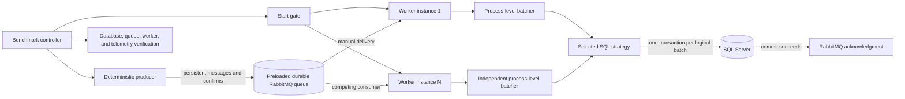
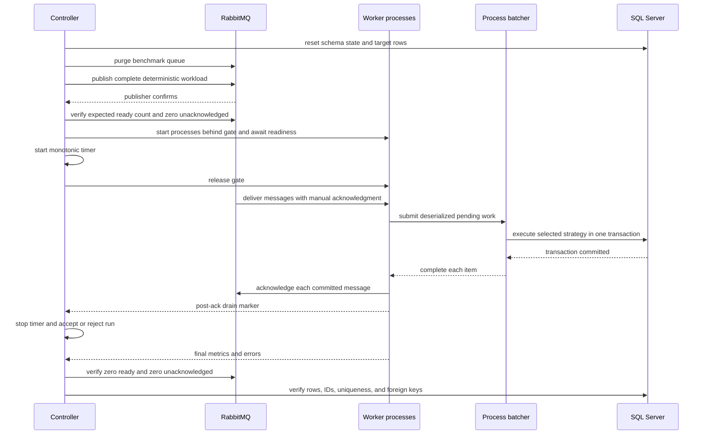

# SQL Server insert batching benchmarks

This repository asks a narrow question: for a preloaded RabbitMQ workload, which tested combination of SQL insert strategy, process-level batcher, writer concurrency, batch size, batching delay, channel capacity, prefetch, parent-key distribution, and worker count commits rows fastest without weakening transaction or acknowledgment semantics?

The answer is an observed result, not a universal recommendation. It applies only to the recorded machine, container limits, schema, workload, durability settings, and configuration matrix.

## Architecture



Each worker process owns its batching state. Worker processes consume from the same queue as competing consumers. The generic batching library has no SQL Server, RabbitMQ, ASP.NET Core, benchmark entity, or benchmark message dependency.



## Persistence strategies

- **Individual insert per message.** One parameterized `INSERT`, one transaction commit, then one acknowledgment. Its legal batch size is one.
- **Table-valued parameter.** The client streams `SqlDataRecord` values into `dbo.BenchmarkRowType`; `dbo.InsertBenchmarkRows` performs one set-based insert and one commit.
- **Multiple INSERT statements.** One parameterized command contains one complete `INSERT` statement per item and commits once. Data values never enter command text.
- **Multi-row VALUES.** One parameterized `INSERT ... VALUES (...), (...)` command commits once. Thirteen parameters per row and SQL Server's 2,100-parameter ceiling limit a command to 161 rows.
- **SqlBulkCopy.** Client-side `Microsoft.Data.SqlClient.SqlBulkCopy` writes through the same explicit transaction with check constraints, null preservation, configurable table locking, timeout, batch size, and streaming mode. This is not T-SQL `BULK INSERT`.

Every strategy uses `READ COMMITTED`, full transaction-log commit semantics, the same target table, constraints, indexes, connection pool, command timeout, and database durability settings. SQL Server uses `SIMPLE` recovery with `DELAYED_DURABILITY = DISABLED`. Simple recovery controls log reuse; it does not turn a transaction commit into a delayed commit.

## Process batching

The `ChannelBatcher<T>` implementation uses a bounded `Channel<T>`, configurable handler concurrency, a maximum batch size, and a monotonic maximum-delay deadline. Bounded writes apply backpressure. Shutdown closes the writer and drains every accepted item before stopping. Each submission receives its own completion task. Metrics cover queue depth, channel wait, batch size, fill time, handler time, completions, failures, and backpressure.

The `LockSwapBatcher<T>` implementation has no intermediate channel. Producers append under a short lock; a full buffer or periodic timer swaps ownership of the list with a new buffer. A capacity semaphore applies equivalent backpressure and a handler semaphore limits concurrency. It drains the final partial buffer on shutdown.

The no-batching baseline invokes the handler immediately. It is used for individual insert per message and does not count as the second batching design.

## Queue and completion semantics

The producer creates deterministic message IDs and payloads, publishes persistent messages to a durable queue, and waits for publisher confirms. Workers stay behind a start gate until the controller verifies the full ready-message count. Publication and process startup are outside the measured interval.

Workers deserialize on delivery. A SQL-backed item becomes committed only after its transaction commits. The worker then acknowledges that delivery on its RabbitMQ channel. A message counts as completed only after both events succeed. The primary runs disable automatic connection recovery and application retry. A failed batch stops the worker, leaves its deliveries unacknowledged, and invalidates the run.

Delivery-to-commit and delivery-to-acknowledgment use `Stopwatch` timestamps inside the worker. Deliberate queue residence before the gate is not reported as latency. Delivered, committed, and acknowledged counts remain separate in every raw result.

The no-op queue control uses the same client, payload, JSON deserialization, competing-consumer topology, prefetch, process batcher, and manual acknowledgment path. Its handler performs no database write. The direct database control sends the pre-generated in-memory rows through the same SQL strategy classes without RabbitMQ, deserialization, process batching, or acknowledgments.

## Schema and data

`dbo.ParentEntity` contains 10,000 seeded rows. `dbo.BenchmarkTarget` has a `bigint IDENTITY` clustered primary key; a unique constraint on deterministic `MessageId`; a foreign key and supporting index on `ParentId`; and columns using `uniqueidentifier`, `datetime2(3)`, `int`, `bigint`, `smallint`, `decimal(18,4)`, `bit`, `varchar`, `nvarchar`, `binary(16)`, and nullable `nvarchar`. The schema stays unchanged across strategies.

The checked-in schema estimates a 390-byte logical row before page and index overhead. The runner records the average serialized JSON message size from each workload in raw output.

The default seed is `1592606758` (`0x5EED2026`). `System.Random` selects parent IDs; SHA-256 of the seed and sequence creates message and correlation IDs plus fixed binary data. Other values derive from the sequence or seeded generator. The three profiles are:

- **Uniform:** every parent ID has equal selection probability.
- **Moderate skew:** 80% of rows select uniformly from parent IDs 1 through 2,000; 20% select from 2,001 through 10,000.
- **Hot parent:** 95% reference parent ID 1; 5% select uniformly from the other parents.

Every strategy in a distribution receives rows generated by the same algorithm and seed.

## Search method

`config/Full.json` is generated by `scripts/generate-full-profile.ps1` and checked in. Its 90 scenarios bound the search rather than forming a wasteful Cartesian product. The broad stage covers every strategy and distribution. Refinement stages vary legal batch sizes, 1/5/20/50 ms delays, capacities, prefetch values, channel versus lock-swap batching, 1/2/4/8 writers, and 1/2/4 worker processes. Direct controls follow, then each selected finalist runs three times. Dynamic SQL tests stop at the calculated 161-row legal maximum. TVP and bulk copy test 10, 50, 100, 500, 1,000, and 5,000 rows.

Stages run in search order; scenario order is rotated deterministically inside each stage. Each implementation receives an unreported warmup, followed by a database and queue reset. Raw configuration remains attached to every result.

<!-- RESULTS:START -->

## Measured results

Generated from 12 raw scenario files. 12 passed every correctness check.

The no-op queue ceiling was **25,133 messages/s** with p99 delivery-to-acknowledgment latency of 5.96 ms.

RabbitMQ did not set the observed ceiling: the no-op path was 6.95x faster than the fastest SQL-backed run (smoke-tvp-queue).


### Best observed queue configuration by strategy

| Strategy | Batcher | Workers x writers | Batch | Delay | Capacity | Prefetch | Distribution | Rows/s | p50 commit | p99 ack | Speedup | Correct |
|---|---|---:|---:|---:|---:|---:|---|---:|---:|---:|---:|---|
| Individual insert per message | None | 1 x 1 | 1 | 5 ms | 100 | 100 | Uniform | 119 | 5.86 ms | 14.35 ms | 1.00x | yes |
| Table-valued parameter | Channel | 1 x 1 | 100 | 5 ms | 2,000 | 400 | Uniform | 3,615 | 48.49 ms | 195.41 ms | 30.36x | yes |
| Multiple INSERT statements | Channel | 1 x 1 | 100 | 5 ms | 2,000 | 400 | Uniform | 2,881 | 85.42 ms | 244.06 ms | 24.20x | yes |
| Multi-row VALUES | Channel | 1 x 1 | 100 | 5 ms | 2,000 | 400 | Uniform | 188 | 100.24 ms | 298.31 ms | 1.58x | yes |
| SqlBulkCopy | Channel | 1 x 1 | 500 | 5 ms | 2,000 | 1,000 | Uniform | 3,122 | 110.26 ms | 359.67 ms | 26.22x | yes |

### Direct-to-database controls

| Strategy | Writers | Batch | Direct rows/s | Best queue rows/s | Queue/direct | p50 commit delta | SQL p50 | Transaction p50 |
|---|---:|---:|---:|---:|---:|---:|---:|---:|
| Individual insert per message | 1 | 1 | 115 | 119 | 103.5 % | -4.44 ms | 1.68 ms | 10.17 ms |
| Table-valued parameter | 1 | 100 | 9,873 | 3,615 | 36.6 % | 40.70 ms | 2.99 ms | 7.71 ms |
| Multiple INSERT statements | 1 | 100 | 4,109 | 2,881 | 70.1 % | 63.11 ms | 16.19 ms | 22.27 ms |
| Multi-row VALUES | 1 | 100 | 5,376 | 188 | 3.5 % | 82.70 ms | 12.15 ms | 17.48 ms |
| SqlBulkCopy | 1 | 500 | 10,707 | 3,122 | 29.2 % | 64.09 ms | 39.23 ms | 46.08 ms |

### Worker scaling

| Strategy | Workers | Best rows/s | p99 ack | Delivered share range | Mean batch size |
|---|---:|---:|---:|---:|---:|

### Throughput-latency Pareto frontier

| Strategy | Scenario | Rows/s | p99 ack | Batch | Writers | Workers |
|---|---|---:|---:|---:|---:|---:|
| Individual insert per message | smoke-individual-queue | 119 | 14.35 ms | 1 | 1 | 1 |
| Multiple INSERT statements | smoke-statements-queue | 2,881 | 244.06 ms | 100 | 1 | 1 |
| Multi-row VALUES | smoke-values-queue | 188 | 298.31 ms | 100 | 1 | 1 |
| Table-valued parameter | smoke-tvp-queue | 3,615 | 195.41 ms | 100 | 1 | 1 |
| SqlBulkCopy | smoke-bulk-queue-channel | 3,122 | 359.67 ms | 500 | 1 | 1 |

### Correctness

Every published run passed row-count, distinct-ID, missing-ID, foreign-key, queue-ready, queue-unacknowledged, acknowledgment, and worker-error checks.

### Raw data

- [smoke-bulk-direct, repetition 1](results/local/20260904-164239-smoke/smoke-bulk-direct-r1.json)
- [smoke-bulk-queue-channel, repetition 1](results/local/20260904-164239-smoke/smoke-bulk-queue-channel-r1.json)
- [smoke-bulk-queue-lock-swap, repetition 1](results/local/20260904-164239-smoke/smoke-bulk-queue-lock-swap-r1.json)
- [smoke-individual-direct, repetition 1](results/local/20260904-164239-smoke/smoke-individual-direct-r1.json)
- [smoke-individual-queue, repetition 1](results/local/20260904-164239-smoke/smoke-individual-queue-r1.json)
- [smoke-noop-queue, repetition 1](results/local/20260904-164239-smoke/smoke-noop-queue-r1.json)
- [smoke-statements-direct, repetition 1](results/local/20260904-164239-smoke/smoke-statements-direct-r1.json)
- [smoke-statements-queue, repetition 1](results/local/20260904-164239-smoke/smoke-statements-queue-r1.json)
- [smoke-tvp-direct, repetition 1](results/local/20260904-164239-smoke/smoke-tvp-direct-r1.json)
- [smoke-tvp-queue, repetition 1](results/local/20260904-164239-smoke/smoke-tvp-queue-r1.json)
- [smoke-values-direct, repetition 1](results/local/20260904-164239-smoke/smoke-values-direct-r1.json)
- [smoke-values-queue, repetition 1](results/local/20260904-164239-smoke/smoke-values-queue-r1.json)
<!-- RESULTS:END -->

## Recorded environment

The published run records host and container details in its result directory. The benchmark constrains SQL Server to four CPUs and 4 GiB, RabbitMQ to two CPUs and 1 GiB, and keeps those limits fixed. Exact images are pinned by tag and multi-platform digest:

- SQL Server Developer 2025 CU8 on Ubuntu 22.04, `sha256:2f9da673779dc5556d385164f6b1541d169ff1eeed97b9833ca0308e8628e683`
- RabbitMQ 4.3.5 management, `sha256:ffd1b50c522ad20172ffd6716a2f41db375c7269560c8f3fb9a694e210ef0852`
- .NET SDK 10.0.400 and runtime 10.0.11
- Aspire 13.5.3
- `Microsoft.Data.SqlClient` 7.0.2 and `RabbitMQ.Client` 7.2.2

`Directory.Packages.props`, `global.json`, `compose.yaml`, and the worker Dockerfile are the version authorities.

## Reproduce

Prerequisites are Docker with Compose, .NET SDK 10.0.400 or a compatible patch selected by `global.json`, and PowerShell Core 7. The scripts create random credentials in process memory and do not write them to the repository.

Run the quick correctness and performance check:

```powershell
pwsh ./scripts/run-benchmarks.ps1 -Profile Smoke
```

Run the staged matrix:

```powershell
pwsh ./scripts/run-benchmarks.ps1 -Profile Full
```

Keep containers for inspection:

```powershell
pwsh ./scripts/run-benchmarks.ps1 -Profile Smoke -LeaveRunning
```

Start the development graph and dashboard:

```text
aspire run
```

In another terminal, run the smoke profile against the Aspire-provided resources using the environment values shown for the controller resource in the dashboard:

```powershell
pwsh ./scripts/run-benchmarks.ps1 -Profile Smoke -UseRunningEnvironment
```

Run one selected full-profile scenario the same way:

```powershell
pwsh ./scripts/run-benchmarks.ps1 -Profile Full -Scenario refine-bulk-batch-1000 -UseRunningEnvironment
```

See [setup and troubleshooting](docs/setup.md) for profile filters, overrides, Aspire worker replicas, Compose scaling, readiness failures, and cleanup behavior.

## Correctness suite

The unit suite checks maximum batch size and delay, bounded-channel backpressure, canceled producers, graceful drain, handler failure, per-item outcomes, handler concurrency, an empty stop, and the final partial batch. Integration tests exercise every SQL strategy at several logical workload sizes, verify all inserted IDs, test transaction rollback for every batched strategy, preserve an earlier committed individual insert when a later message fails, and prove that a failed transactional batch is requeued without acknowledgments.

CI builds with nullable references and recommended analyzers enabled, runs unit tests, starts the pinned dependencies, and runs integration correctness tests. Primary performance data comes only from explicit local benchmark runs, never CI timing.

## Limitations

- Results describe one local containerized machine and are sensitive to storage, CPU scheduling, thermal state, Docker virtualization, SQL Server cache state, and other activity.
- Application metrics include process CPU, peak working set, allocations, garbage collections, batch behavior, SQL timing, and latency. SQL Server DMV snapshots and RabbitMQ management snapshots are before/after values, so they are less precise than dedicated host telemetry.
- `SqlBulkCopy` streams each logical batch through an `IDataReader`; the process batcher still owns the batch's message objects until commit.
- Direct database controls use the same adapters and transactions but do not reproduce every scheduling cost in the worker process.
- The checked-in matrix is bounded. It cannot establish a global optimum beyond its listed values.
